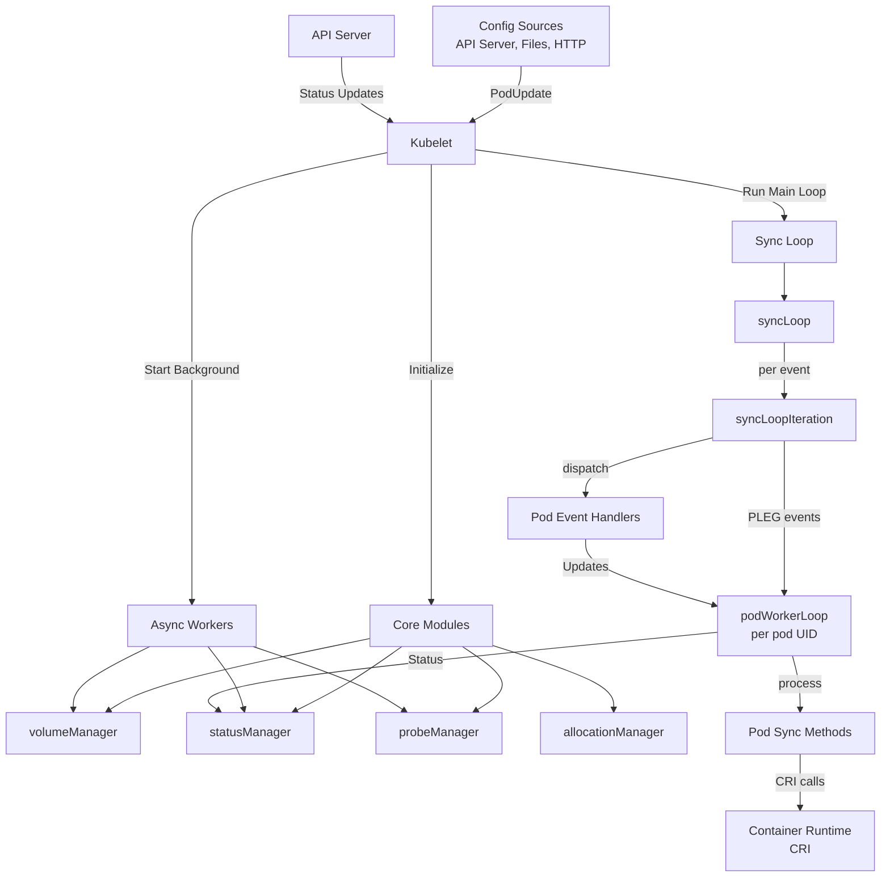
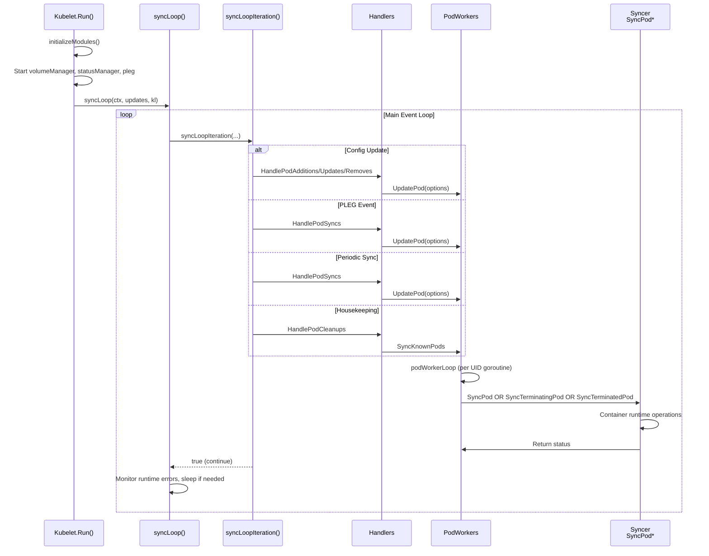

# Kubernetes Kubelet Run Method - Design Document

## 1. Overview

**Feature Name**: Kubelet Main Loop - Pod Lifecycle Management

**Purpose**: The `Run` method is the primary entry point for the kubelet's main execution loop. It initializes all internal modules, starts background goroutines for various subsystems (volume manager, status management, probes, node lease controller), and drives the main synchronization loop that processes pod lifecycle events from multiple sources (API server, static pods, file system). The kubelet acts as the node-level agent responsible for orchestrating pod scheduling, container runtime operations, and resource management on a Kubernetes node.

**Entry Point**:
- **Package**: `k8s.io/kubernetes/pkg/kubelet`
- **File**: kubelet.go
- **Function**: `func (kl *Kubelet) Run(updates <-chan kubetypes.PodUpdate)`
- **Receiver**: `*Kubelet` (main kubelet instance)
- **Parameters**: `updates <-chan kubetypes.PodUpdate` — channel receiving pod configuration updates from various sources
- **Return**: None (runs indefinitely)

**Architecture Role**: 
The kubelet is a critical system component that bridges the Kubernetes API server and the container runtime. It implements six key responsibilities:
1. **Pod lifecycle management** — Syncs desired pod state (from API server) to actual container state (via container runtime)
2. **Node status reporting** — Updates the API server with node conditions, pod statuses, and resource metrics
3. **Volume orchestration** — Attaches, mounts, and unmounts volumes for running pods
4. **Pod admission** — Validates pods against resource constraints and security policies before admission
5. **Container health monitoring** — Executes liveness, readiness, and startup probes
6. **Resource management** — Enforces CPU/memory limits, performs garbage collection, and evicts pods under resource pressure

---

## 2. Architecture Diagram



---

## 3. Call Graph (Depth 0–3)

```mermaid
graph TD
    RUN["Run()"]
    
    RUN --> INIT["initializeModules<br/>ctx"]
    RUN --> ALLOC["allocationManager.Run<br/>ctx"]
    RUN --> VMGR["volumeManager.Run<br/>ctx, sourcesReady"]
    RUN --> SYNC_NODE["syncNodeStatus<br/>periodic"]
    RUN --> SYNC_NODE_ONCE["fastStatusUpdateOnce<br/>one-shot"]
    RUN --> LEASE["nodeLeaseController.Run<br/>ctx"]
    RUN --> STATIC_REG["fastStaticPodsRegistration<br/>ctx"]
    RUN --> UPDATE_RUNTIME["updateRuntimeUp<br/>periodic"]
    RUN --> INIT_NET["initNetworkUtil<br/>iptables setup"]
    RUN --> STATUS_START["statusManager.Start<br/>ctx"]
    RUN --> RUNTIME_CLASS["runtimeClassManager.Start<br/>NeverStop"]
    RUN --> PLEG_START["pleg.Start"]
    RUN --> EVENTED_PLEG["eventedPleg.Start"]
    RUN --> WATCH_DOG["healthChecker.SetHealthCheckers"]
    RUN --> SYNC_LOOP["syncLoop<br/>ctx, updates, kl"]
    
    SYNC_LOOP --> SYNC_LOOP_ITER["syncLoopIteration<br/>ctx, configCh, handler..."]
    
    SYNC_LOOP_ITER --> CONFIG_HANDLER["Match u.Op:<br/>ADD/UPDATE/REMOVE/RECONCILE/DELETE"]
    SYNC_LOOP_ITER --> PLEG_HANDLER["PLEG Event Handler:<br/>update runtimeCache, sync"]
    SYNC_LOOP_ITER --> SYNC_CH_HANDLER["Sync Channel:<br/>get pods to sync"]
    SYNC_LOOP_ITER --> LIVENESS["Liveness Manager Update"]
    SYNC_LOOP_ITER --> READINESS["Readiness Manager Update"]
    SYNC_LOOP_ITER --> STARTUP["Startup Manager Update"]
    SYNC_LOOP_ITER --> CONTAINER_MGR["Container Manager Update"]
    SYNC_LOOP_ITER --> HOUSEKEEPING["Housekeeping Channel"]
    
    CONFIG_HANDLER --> HANDLE_ADD["HandlePodAdditions<br/>pods"]
    CONFIG_HANDLER --> HANDLE_UPDATE["HandlePodUpdates<br/>pods"]
    CONFIG_HANDLER --> HANDLE_REMOVE["HandlePodRemoves<br/>pods"]
    CONFIG_HANDLER --> HANDLE_RECONCILE["HandlePodReconcile<br/>pods"]
    SYNC_CH_HANDLER --> HANDLE_SYNCS["HandlePodSyncs<br/>pods"]
    HOUSEKEEPING --> HANDLE_CLEANUP["HandlePodCleanups<br/>ctx"]
    
    HANDLE_ADD --> POD_MGR_ADD["podManager.AddPod<br/>pod"]
    HANDLE_ADD --> UPDATE_POD["podWorkers.UpdatePod<br/>options"]
    HANDLE_UPDATE --> UPDATE_POD
    HANDLE_REMOVE --> UPDATE_POD
    HANDLE_RECONCILE --> UPDATE_POD
    HANDLE_SYNCS --> UPDATE_POD
    
    UPDATE_POD --> SPAWN_WORKER["spawn podWorkerLoop<br/>uid, podUpdates"]
    UPDATE_POD --> SIGNAL_WORKER["signal podUpdates channel"]
    
    SPAWN_WORKER --> WORKER_LOOP["podWorkerLoop<br/>uid, podUpdates"]
    WORKER_LOOP --> START_POD_SYNC["startPodSync<br/>uid"]
    WORKER_LOOP --> SYNC_CASE["switch WorkType"]
    SYNC_CASE --> SYNC_POD["SyncPod<br/>ctx, type, pod, mirrorPod, status"]
    SYNC_CASE --> SYNC_TERM["SyncTerminatingPod<br/>ctx, pod, status, grace, fn"]
    SYNC_CASE --> SYNC_TERMINATED["SyncTerminatedPod<br/>ctx, pod, status"]
    
    HANDLE_CLEANUP --> RUNTIME_PODS["runtimeCache.GetPods<br/>ctx"]
    HANDLE_CLEANUP --> SYNC_KNOWN["podWorkers.SyncKnownPods<br/>allPods"]
    HANDLE_CLEANUP --> PROBE_CLEANUP["probeManager.CleanupPods<br/>possiblyRunning"]
    HANDLE_CLEANUP --> ORPHAN_STATUS["removeOrphanedPodStatuses<br/>allPods, mirrorPods"]
    
    style RUN fill:#ff6b6b
    style SYNC_LOOP fill:#4ecdc4
    style SYNC_LOOP_ITER fill:#45b7d1
    style UPDATE_POD fill:#f7b731
    style WORKER_LOOP fill:#5f27cd
    style SYNC_CASE fill:#a29bfe
    style SYNC_POD fill:#00b894
    style SYNC_TERM fill:#fdcb6e
    style SYNC_TERMINATED fill:#e17055
```



---

## 4. Detailed Flow Analysis

### Depth 0: Entry Point — `Run()`

**Signature**:
```go
func (kl *Kubelet) Run(updates <-chan kubetypes.PodUpdate)
```

**Purpose**: Initialize all kubelet subsystems and start the main event-driven loop that processes pod configuration and status updates.

**Logic Flow**:

1. **Initialize log server** (lines 1734–1758)
   - If feature gate `NodeLogQuery` is enabled, configure HTTP log query handler with validation
   - Otherwise, configure simple file server for `/logs/` directory access

2. **Call `initializeModules(ctx)`** (lines 1769–1771)
   - Setup filesystem directories for pod data, logs, checkpoints
   - Start image manager (pulls images before pods run)
   - Start certificate manager for kubelet serving certificate rotation
   - Start OOM watcher for kernel OOM event handling
   - Start resource analyzer for metrics collection

3. **Check cgroup version** (lines 1773–1775)
   - Log warning if cgroup version check fails (does not block)

4. **Start allocation manager** (lines 1778–1781)
   - Manages pod resource allocations (CPU, memory for in-place scaling)
   - Runs as an async loop responding to Pod admission events

5. **Start volume manager** (lines 1784–1785)
   - Spawns goroutine: `go kl.volumeManager.Run(ctx, kl.sourcesReady)`
   - Attaches/mounts volumes and watches for pod spec changes

6. **Start node status sync** (lines 1787–1807)
   - If `kl.kubeClient != nil` (configured to report to API server):
     - Spawns `syncNodeStatus` with `nodeStatusUpdateFrequency` ticker and jitter (0.04)
     - Updates node conditions, pod statuses, allocatable resources
     - Called `updateRuntimeUp()` first to check container runtime readiness
     - Spawns `fastStatusUpdateOnce()` goroutine for early node-ready status update (improves latency)
     - Spawns `nodeLeaseController.Run()` to update node lease for kubelet liveness detection
     - Spawns `fastStaticPodsRegistration()` to create mirror pods for static pods early

7. **Start periodic runtime status check** (lines 1809–1810)
   - Spawns `updateRuntimeUp()` every 5 seconds to detect container runtime failures

8. **Setup iptables utility chains** (lines 1812–1815)
   - If `kl.makeIPTablesUtilChains` is true, call `initNetworkUtil()`
   - Sets up iptables rules for kubelet internal networking

9. **Start component sync loops** (lines 1817–1833)
   - `statusManager.Start(ctx)` — Watches pod status changes, syncs to API server
   - `runtimeClassManager.Start(wait.NeverStop)` — If RuntimeClass feature is enabled
   - `pleg.Start()` — Pod Lifecycle Event Generator (polls container runtime periodically)
   - `eventedPleg.Start()` — If `EventedPLEG` feature gate enabled (event-driven PLEG for low latency)
   - `healthChecker.SetHealthCheckers()` — If `SystemdWatchdog` feature gate enabled

10. **Enter main sync loop** (lines 1835)
    - `kl.syncLoop(ctx, updates, kl)` — Runs indefinitely, processing pod events

**Key Decisions**:
- **Gating by `kl.kubeClient`**: Only starts API server sync goroutines if kubelet is configured to report to API server
- **Graceful fallback**: If modules fail to start, logs error but continues (except for critical modules like cAdvisor on container runtime initialization)
- **Concurrency model**: Multiple independent background goroutines + main sync loop

**Called Functions**:
1. `initializeModules(ctx)` — (internal, Depth 1)
2. `kl.allocationManager.Run(ctx)` — External: returns immediately or starts async loop
3. `kl.volumeManager.Run(ctx, kl.sourcesReady)` — External: long-running, channel-based
4. `kl.syncNodeStatus` — (internal, Depth 1)
5. `kl.fastStatusUpdateOnce()` — (internal, Depth 1)
6. `kl.nodeLeaseController.Run(ctx)` — External: long-running event loop
7. `kl.fastStaticPodsRegistration(ctx)` — (internal, Depth 1)
8. `kl.updateRuntimeUp()` — (internal, Depth 1)
9. `kl.initNetworkUtil()` — (internal, Depth 1)
10. `kl.statusManager.Start(ctx)` — External: starts async processing
11. `kl.runtimeClassManager.Start(wait.NeverStop)` — External: starts async processing
12. `kl.pleg.Start()` — External: starts PLEG polling
13. `kl.eventedPleg.Start()` — External: starts evented PLEG
14. `kl.healthChecker.SetHealthCheckers(...)` — External: sets up watchdog
15. `kl.syncLoop(ctx, updates, kl)` — (internal Depth 1, main event loop)

---

### Depth 1: Main Sync Loop — `syncLoop()`

**Signature**:
```go
func (kl *Kubelet) syncLoop(ctx context.Context, updates <-chan kubetypes.PodUpdate, handler SyncHandler)
```

**Purpose**: Main event-driven loop that monitors multiple channels (config updates, PLEG events, periodic syncs, housekeeping) and dispatches pod events to handlers. Implements exponential backoff on container runtime errors.

**Logic Flow**:

1. **Log startup** (line 2427)
   - "Starting kubelet main sync loop"

2. **Initialize tickers and channels** (lines 2428–2440)
   - `syncTicker` — 1-second interval to check if pod workers need sync (defaultResyncInterval is 10s)
   - `housekeepingTicker` — `housekeepingPeriod` interval for cleanup operations
   - `plegCh` — Channel watching for PLEG (Pod Lifecycle Event Generator) events from container runtime
   - DNS resolver limits check if configured (queries resolv.conf limits)

3. **Main event loop** (lines 2441–2456)
   - Continuously calls `syncLoopIteration(ctx, updates, handler, syncTicker.C, housekeepingTicker.C, plegCh)`
   - Returns false on error/shutdown, breaks the loop
   - **Exponential backoff on runtime errors**:
     - On `runtimeState.runtimeErrors()` returns error, wait with backoff (100ms–5s, factor 2)
     - If runtime becomes healthy again, reset backoff to base (100ms)
   - Updates `kl.syncLoopMonitor` with current time before and after each iteration for health checks
   - Loop continues until `syncLoopIteration` returns false

**Key Decisions**:
- **One-second sync tick** for pod worker resync even though resyncInterval is 10s, allowing prompt response to state checker
- **Exponential backoff on runtime errors** prevents CPU spinning when container runtime is unavailable
- **Never-stopping loop** relies on explicit `syncLoopIteration` returning false

**Called Functions**:
1. `kl.syncLoopIteration(ctx, updates, handler, syncCh, housekeepingCh, plegCh)` — (internal, Depth 2, returns bool)

---

### Depth 2: Iteration Handler — `syncLoopIteration()`

**Signature**:
```go
func (kl *Kubelet) syncLoopIteration(
    ctx context.Context, 
    configCh <-chan kubetypes.PodUpdate, 
    handler SyncHandler,
    syncCh <-chan time.Time, 
    housekeepingCh <-chan time.Time, 
    plegCh <-chan *pleg.PodLifecycleEvent,
) bool
```

**Purpose**: Block-multiplexed handler that processes one event from 6 different sources in pseudorandom order. Each channel is associated with specific pod lifecycle events and actions.

**Logic Flow** — Pseudo-code (using select statement):

#### **Case 1: Config Channel** (`configCh`)
- **Trigger**: New pod configuration from any source (API server, files, HTTP)
- **Logic**:
  1. Check if channel is closed → return false (shutdown signal)
  2. Match update operation (`u.Op`):
     - `kubetypes.ADD` → `handler.HandlePodAdditions(u.Pods)`
     - `kubetypes.UPDATE` → `handler.HandlePodUpdates(u.Pods)`
     - `kubetypes.REMOVE` → `handler.HandlePodRemoves(u.Pods)`
     - `kubetypes.RECONCILE` → `handler.HandlePodReconcile(u.Pods)`
     - `kubetypes.DELETE` → `handler.HandlePodUpdates(u.Pods)` (treated as update for graceful deletion)
     - `kubetypes.SET` → Log error (not supported)
  3. Call `kl.sourcesReady.AddSource(u.Source)` to track config sources

#### **Case 2: PLEG Channel** (`plegCh`)
- **Trigger**: Pod Lifecycle Event from container runtime (container created, started, died, etc.)
- **Logic**:
  1. Filter via `isSyncPodWorthy(e)` — skip `ContainerRemoved` events
  2. Lookup pod by UID using `kl.podManager.GetPodByUID(e.ID)`
  3. If pod exists → `handler.HandlePodSyncs([]*v1.Pod{pod})` (force resync)
  4. If pod doesn't exist → ignore silently (pod may have been deleted)
  5. If event type is `pleg.ContainerDied`:
     - Extract container ID from event data
     - Call `kl.cleanUpContainersInPod(e.ID, containerID)` to remove exited container

#### **Case 3: Sync Channel** (`syncCh`)
- **Trigger**: Periodic ticker (1-second interval)
- **Logic**:
  1. Call `kl.getPodsToSync()` to retrieve pods needing resync
  2. If no pods → break (no action needed)
  3. Log sync attempt with pod count
  4. Call `handler.HandlePodSyncs(podsToSync)` to force full pod reconciliation

#### **Case 4: Liveness Manager Updates** 
- **Trigger**: Pod liveness probe fails (unhealthy container detected)
- **Logic**:
  1. If probe result is `proberesults.Failure`:
     - Call `handleProbeSync(kl, update, handler, "liveness", "unhealthy")`
     - This syncs the pod to restart/log the unhealthy container

#### **Case 5: Readiness Manager Updates**
- **Trigger**: Pod readiness probe status changes (container readiness state transitions)
- **Logic**:
  1. Extract readiness result
  2. Call `kl.statusManager.SetContainerReadiness(ctx, podUID, containerID, ready)`
  3. Call `handleProbeSync()` with readiness status

#### **Case 6: Startup Manager Updates**
- **Trigger**: Pod startup probe completes (container should transition to running)
- **Logic**:
  1. Extract startup result
  2. Call `kl.statusManager.SetContainerStartup(ctx, podUID, containerID, started)`
  3. Call `handleProbeSync()` with startup status

#### **Case 7: Container Manager Updates**
- **Trigger**: Device or resource allocation changes for a pod
- **Logic**:
  1. Loop through changed pod UIDs from event
  2. Lookup pods using `kl.podManager.GetPodByUID(p)`
  3. Collect found pods into a list
  4. If any pods found → `handler.HandlePodSyncs(pods)` to apply resource updates

#### **Case 8: Housekeeping Channel** (`housekeepingCh`)
- **Trigger**: Periodic housekeeping ticker (default `housekeepingPeriod`)
- **Logic**:
  1. Check if sources are ready via `kl.sourcesReady.AllReady()`:
     - If not ready → skip housekeeping (avoid deleting pods from unready sources)
  2. If ready:
     - Record start time
     - Call `handler.HandlePodCleanups(ctx)` to clean up terminated/orphaned pods
     - Log warnings if cleanup took longer than threshold (`housekeepingWarningDuration`)
  3. Always return true (continue loop)

**Return**: `true` to continue loop, `false` to exit (usually on config channel close)

**Key Decisions**:
- **Pseudorandom select order**: Fairness across event types, no starvation of specific channels
- **Filtering on PLEG**: Skip non-meaningful events (ContainerRemoved) to reduce spurious syncs
- **Gating housekeeping on sources ready**: Prevents premature cleanup of unconfigured pods
- **Handler methods abstract sync logic**: Allows testing with mock handlers

**Called Functions**:
1. `handler.HandlePodAdditions([]*v1.Pod)` — (Depth 2, internal to Kubelet)
2. `handler.HandlePodUpdates([]*v1.Pod)` — (Depth 2, internal to Kubelet)
3. `handler.HandlePodRemoves([]*v1.Pod)` — (Depth 2, internal to Kubelet)
4. `handler.HandlePodReconcile([]*v1.Pod)` — (Depth 2, internal to Kubelet)
5. `handler.HandlePodSyncs([]*v1.Pod)` — (Depth 2, internal to Kubelet)
6. `handler.HandlePodCleanups(ctx context.Context)` — (Depth 2, in kubelet_pods.go)
7. `kl.podManager.GetPodByUID(types.UID)` — External (PodManager)
8. `kl.getPodsToSync()` — (internal)
9. `handleProbeSync(kl, update, handler, probe, status)` — (helper function, Depth 2)
10. `kl.statusManager.SetContainerReadiness(...)` — External
11. `kl.statusManager.SetContainerStartup(...)` — External
12. `kl.cleanUpContainersInPod(podID, containerID)` — (internal)
13. `kl.sourcesReady.AllReady()` — (internal)

---

### Depth 2: Pod Addition Handler — `HandlePodAdditions()`

**Signature**:
```go
func (kl *Kubelet) HandlePodAdditions(pods []*v1.Pod)
```

**Purpose**: Process newly discovered pods from configuration sources and admit them for running. Performs pod admission to ensure resource constraints and security policies are met.

**Logic Flow**:

1. **Sort pods by creation time** (line 2641)
   - Ensures older pods are processed first for consistent ordering

2. **Loop through each pod** (line 2643):
   
   a. **Add pod to pod manager** (line 2646)
      - `kl.podManager.AddPod(pod)` — Track as desired pod (source of truth)
   
   b. **Track pod certificate** if using pod certificates (line 2647)
      - `kl.podCertificateManager.TrackPod(context.TODO(), pod)` 
   
   c. **Get mirror pod if static pod** (line 2649)
      - Call `kl.podManager.GetPodAndMirrorPod(pod)` — Retrieve mirror pod reference if applicable
      - If this is a mirror pod addition (not the static pod), skip admission checks
      - Message the static pod's pod worker with sync update and continue
   
   d. **Check termination status** (line 2659)
      - If pod is already marked for termination or in terminal phase (Succeeded/Failed):
        - Skip admission
        - Continue to next pod
   
   e. **Pod admission check** (line 2663)
      - Call `kl.allocationManager.AddPod(kl.GetActivePods(), pod)`:
        - Validates pod fits node resources (CPU, memory, ephemeral storage, pods count)
        - Verifies QoS class constraints
        - Returns (ok bool, reason, message)
      - If admission fails:
        - Call `kl.rejectPod(pod, reason, message)` to reject with status
        - Record admission rejection metric
        - Continue to next pod
   
   f. **Handle in-place resize if enabled** (lines 2671–2676)
      - If `InPlacePodVerticalScaling` feature gate enabled:
        - Call `kl.allocationManager.UpdatePodFromAllocation(pod)` to update pod spec
        - If pod was updated from allocation, queue for resize processing
   
   g. **Update pod worker** (line 2680)
      - Call `kl.podWorkers.UpdatePod(UpdatePodOptions{...})`
      - Parameters:
        - `Pod`: the admission-checked pod
        - `MirrorPod`: mirror pod reference if static
        - `UpdateType`: `kubetypes.SyncPodCreate` (first time setup)
        - `StartTime`: timestamp for latency metrics

**Key Decisions**:
- **Static pod handling**: Mirror pods are skipped (already have config), only sync the static pod
- **Admission before worker update**: Ensures no out-of-resource pods reach pod workers
- **Metric recording**: Captures admission rejection for observability
- **Resize queue**: Separates resize events from new adds for tracking

**Called Functions**:
1. `sort.Sort(sliceutils.PodsByCreationTime(pods))` — External (stdlib)
2. `kl.podManager.AddPod(pod)` — External
3. `kl.podCertificateManager.TrackPod(ctx, pod)` — External
4. `kl.podManager.GetPodAndMirrorPod(pod)` — External
5. `kl.podWorkers.IsPodTerminationRequested(uid)` — External
6. `kl.allocationManager.AddPod(activePods, pod)` — External
7. `kl.rejectPod(pod, reason, message)` — Internal
8. `recordAdmissionRejection(reason)` — Internal
9. `kl.allocationManager.UpdatePodFromAllocation(pod)` — External
10. `kl.podWorkers.UpdatePod(options)` — External (Depth 1 via PodWorkers interface)

---

### Depth 3: Pod Worker Update — `podWorkers.UpdatePod()`

**Signature** (from pod_workers.go line 755):
```go
func (p *podWorkers) UpdatePod(options UpdatePodOptions)
```

**Purpose**: Notify pod worker goroutine (one per pod UID) of a pod state change. Queues update in FIFO order and signals worker if needed. Manages pod lifecycle state transitions (syncing → terminating → terminated).

**Logic Flow**:

1. **Extract pod identity** (lines 767–785)
   - Handle both real Pod and RunningPod (orphaned, no config)
   - For RunningPods, can only process `SyncPodKill` updates
   - Store uid, namespace, name for logging and tracking

2. **Acquire pod-level lock** (lines 787–788)
   - `p.podLock.Lock()` for entire update operation

3. **Create or retrieve pod sync status** (lines 792–820)
   - If pod UID not in `p.podSyncStatuses` map:
     - Create new `podSyncStatus` with current timestamp
     - Check if terminal pod (Succeeded/Failed phase):
       - Query runtime cache to confirm
       - If truly terminal, mark as already terminated/terminating
   - Store status in map keyed by UID

4. **Handle runtime-only pods** (lines 822–840)
   - If update includes RunningPod (orphaned):
     - Set observedRuntime flag
     - Fall back to existing Pod spec from pendingUpdate/activeUpdate if available
     - Otherwise use RunningPod.ToAPIPod() synthetic pod

5. **Detect restart scenario** (lines 842–850)
   - If pod is terminating but receives CREATE update (same UID reuse):
     - Set `restartRequested` flag to reset after termination completes
     - Return early (don't start new sync until old pod terminates)

6. **Guard against post-termination updates** (lines 852–857)
   - If pod marked as finished (past all sync phases):
     - Ignore further updates
     - Return early

7. **Check for termination request** (lines 859–885)
   - Determine if pod should transition to terminating state:
     - Runtime pod (orphaned) → mark deleted, begin termination
     - `pod.DeletionTimestamp != nil` → graceful deletion, begin termination
     - `pod.Status.Phase == PodFailed || PodSucceeded` → terminal, begin termination
     - `options.UpdateType == SyncPodKill` → explicit kill, begin termination (if evict, mark evicted)
   - If became terminating:
     - Set `status.terminatingAt = now`
     - Set `becameTerminating = true` flag

8. **Update grace period if terminating** (lines 887–930)
   - For already-terminating pods:
     - Extract grace period from KillPodOptions
     - Allow grace period to only decrease (shorter grace allowed)
     - Update status.gracePeriod
     - Set KillPodOptions.PodTerminationGracePeriodSecondsOverride for syncer
   - For not-yet-terminating pods:
     - Store KillPodOptions for later when termination is triggered

9. **Spawn pod worker goroutine if needed** (lines 932–960)
   - If pod UID not in `p.podUpdates` map:
     - Create buffered channel: `podUpdates := make(chan struct{}, 1)`
     - Store in map
     - For static pods, track in `waitingToStartStaticPodsByFullname` queue
     - Spawn goroutine: `go p.podWorkerLoop(uid, outCh)`
     - Runs indefinitely until pod worker returns

10. **Update pending state** (lines 962–973)
    - Store updated options in `status.pendingUpdate`
    - If `InPlacePodVerticalScaling` enabled, apply allocation updates
    - Mark pod as `working = true`
    - Log pending update

11. **Signal pod worker** (lines 974–977)
    - Send non-blocking signal to `podUpdates` channel: `select { case podUpdates <- struct{}{}: }`
    - Wakes up pod worker to process the update (could also be already processing)

12. **Handle grace period changes** (lines 979–984)
    - If pod became terminating or grace period shortened and pod worker is running:
      - Call `status.cancelFn()` to cancel current pod sync context
      - Allows shorter grace period to take effect immediately

**Key Decisions**:
- **Per-pod UID goroutine**: Each pod UID gets exactly one worker goroutine, ensuring serialized processing
- **Buffered channel**: 1-capacity channel allows Update to proceed without blocking even if worker is slow
- **FIFO semantics**: pendingUpdate always replaces previous pending (only latest state matters)
- **Grace period can only decrease**: Ensures we honor shorter grace periods (preemption scenarios)
- **Cancel on grace period change**: Forces immediate re-sync with new grace period

**Called Functions**:
1. `kubecontainer.BuildPodFullName(name, ns)` — External (stdlib)
2. `p.podCache.Get(uid)` — External (local cache)
3. `isPodStatusCacheTerminal(statusCache)` — Internal helper
4. `waitForStaticPodStart(...)` — Internal helper (for static pod ordering)
5. `p.podWorkerLoop(uid, outCh)` — Spawned goroutine (Depth 2 in pod_workers.go)

---

### Depth 3: Pod Worker Loop — `podWorkerLoop()`

**Signature** (from pod_workers.go line 1237):
```go
func (p *podWorkers) podWorkerLoop(podUID types.UID, podUpdates <-chan struct{})
```

**Purpose**: Goroutine per pod UID that drives the pod's lifecyle through 3 phases (syncing, terminating, terminated). Reads from update channel and invokes appropriate sync methods.

**Logic Flow**:

1. **Initialize** (line 1239)
   - `lastSyncTime = time.Time{}` — Tracks when pod status was last checked

2. **Main loop** (line 1240)
   - `for range podUpdates` — Iteration per signal

3. **Start pod sync** (line 1241)
   - Call `p.startPodSync(podUID)` which:
     - Acquires lock
     - Moves `pendingUpdate` → `activeUpdate`
     - Creates context with cancel function
     - Returns (ctx, update, canStart, canEverStart, ok)
   - Checks returns:
     - `!ok` → no pending update, continue loop
     - `!canEverStart` → pod terminated, exit loop and return
     - `!canStart` → pod not ready yet (e.g., waiting for static pod ordering), continue loop

4. **Log event** (lines 1251-1252)
   - Log "Processing pod event" with pod name, UID, and update type

5. **Execute sync action** (lines 1254–1277)
   - Define inner func that handles the actual sync:
     a. **Fetch pod status** (lines 1270–1284):
        - For RunningPodfs: skip (orphaned, no status updates)
        - Otherwise: `p.podCache.GetNewerThan(pod.UID, lastSyncTime)` to get latest status
        - On cache error: record event and return error
     
     b. **Dispatch to appropriate sync method** based on WorkType (lines 1286–1304):
        - `TerminatedPod` → `p.podSyncer.SyncTerminatedPod(ctx, pod, status)`
        - `TerminatingPod` → `p.podSyncer.SyncTerminatingPod(ctx, pod, status, gracePeriod, podStatusFn)`
          - Or if RunningPod: `p.podSyncer.SyncTerminatingRuntimePod(ctx, runningPod)`
        - `SyncPod` (default) → `p.podSyncer.SyncPod(ctx, updateType, pod, mirrorPod, status)`
           - Returns `(isTerminal bool, err error)` — true if pod reached terminal phase
        - Catch context cancellation and log if needed
     
     c. **Update lastSyncTime** (line 1305)
        - `lastSyncTime = p.clock.Now()` for next status cache check

6. **Handle sync results** (lines 1307–1356)
   - **Context canceled** (lines 1310–1312):
     - Expect pending update queued, log and continue loop
   
   - **Sync error** (lines 1314–1316):
     - Log error, will retry on next signal
   
   - **TerminatedPod succeeded** (lines 1318–1327):
     - Pod cleanup complete, shutdown worker
     - Call `p.completeTerminated(podUID)` to mark finished
     - Record `PodWorkerDuration` metric
     - Return from loop (goroutine exits)
   
   - **TerminatingRuntimePod succeeded** (lines 1329–1335):
     - Orphaned pod fully terminated
     - Call `p.completeTerminatingRuntimePod(podUID)`
     - Record metric
     - Return from loop
   
   - **TerminatingPod succeeded** (lines 1337–1346):
     - Containers stopped, transitioning to cleanup phase
     - Call `p.completeTerminating(podUID)` to move to TerminatedPod state
     - Set `phaseTransition = true`
     - Continue loop (will eventually get TerminatedPod update)
   
   - **SyncPod returned isTerminal=true** (lines 1348–1350):
     - Pod reached natural terminal state (RestartNever + container exited)
     - Request termination, next loop will call SyncTerminatingPod

7. **Loop continues**
   - Wait for next `<-podUpdates` signal
   - Process the queued update with latest activeState

**Key Decisions**:
- **One goroutine per pod**: Serializes all operations for single pod, no race conditions
- **Three-phase lifecycle**: SyncPod (setup) → SyncTerminatingPod (teardown) → SyncTerminatedPod (cleanup)
- **isTerminal signal**: Allows pod to self-terminate when restarts are disabled
- **On-demand status fetches**: Reduces cache overhead, fetches only when needed
- **Context cancellation**: Allows grace period shortening to interrupt long-running syncs

**Called Functions**:
1. `p.startPodSync(podUID)` — Internal (acquires lock, moves pending→active)
2. `podUIDAndRefForUpdate(update.Options)` — Internal helper
3. `p.podCache.GetNewerThan(uid, lastSyncTime)` — External (runtime cache)
4. `p.podSyncer.SyncPod(ctx, type, pod, mirrorPod, status)` — External interface (Kubelet instance)
5. `p.podSyncer.SyncTerminatingPod(ctx, pod, status, grace, fn)` — External interface
6. `p.podSyncer.SyncTerminatingRuntimePod(ctx, pod)` — External interface
7. `p.podSyncer.SyncTerminatedPod(ctx, pod, status)` — External interface
8. `p.acknowledgeTerminating(podUID)` — Internal (returns status callback)
9. `p.completeTerminated(podUID)` — Internal
10. `p.completeTerminating(podUID)` — Internal
11. `p.completeTerminatingRuntimePod(podUID)` — Internal

---

### Depth 3: Core Pod Sync Methods

The pod worker calls three methods on the `podSyncer` interface (implemented by `*Kubelet`):

#### **`SyncPod(ctx, updateType, pod, mirrorPod, podStatus)`** (Depth 3)

**Signature** (from kubelet.go line 1908):
```go
func (kl *Kubelet) SyncPod(
    ctx context.Context, 
    updateType kubetypes.SyncPodType, 
    pod, mirrorPod *v1.Pod, 
    podStatus *kubecontainer.PodStatus,
) (isTerminal bool, err error)
```

**Purpose**: Transaction script to sync a single pod's configuration to desired state. Handles container setup, volume mounting, probe initiation, resource enforcement. Expected to converge toward desired state or return error for retry.

**High-Level Workflow**:
1. Record pod latency metrics
2. Generate and update API pod status via status manager
3. Check soft admission constraints (eviction, resource limits)
4. Configure container runtime cgroups and resource constraints
5. Create static pod mirror pod if needed
6. Setup pod data directories and SELinux context
7. Wait for volumes to mount
8. Pull container images
9. Call container runtime's SyncPod callback to create/update containers
10. Apply traffic shaping (egress limits if supported)
11. Return `isTerminal=true` if pod reached RestartNever terminal phase

**Returns**: `(isTerminal bool, err error)`
- `isTerminal=true`: Pod must begin termination (Succeeded/Failed after RestartNever)
- `err != nil`: Transient error, will retry
- `err = nil && isTerminal=false`: Pod still running, next call will sync again

---

#### **`SyncTerminatingPod(ctx, pod, podStatus, gracePeriod, podStatusFn)`** (Depth 3)

**Purpose**: Stop running containers with grace period, collect final status. Called repeatedly with diminishing grace periods until successful.

**Workflow**:
1. Send SIGTERM to containers (grace period from pod spec or override)
2. Poll containers until they exit or grace period expires
3. If grace period expires, send SIGKILL
4. Collect exit codes, reasons, and final pod status
5. Update pod status via callback

---

#### **`SyncTerminatedPod(ctx, pod, podStatus)`** (Depth 3)

**Purpose**: Release resources after containers are stopped. Called after SyncTerminatingPod succeeds.

**Cleanup Actions**:
1. Unmount volumes
2. Remove pod cgroups
3. Remove pod directories (except logs if needed)
4. Update final pod status to API server
5. Clean up any remaining container logs, device allocations

---

## 5. Sequence Diagram



---

## 6. Key Data Structures

### **Kubelet**
Main struct managing pod lifecycle on a node. Key fields:

```go
type Kubelet struct {
    nodeName types.NodeName
    kubeClient clientset.Interface            // API connectivity
    podManager kubepod.Manager                // Desired pods state (source of truth)
    podWorkers PodWorkers                     // Actual running pods state machine
    statusManager status.Manager              // Syncs pod status to API server
    volumeManager volumemanager.VolumeManager // Mount/attach volumes
    probeManager prober.Manager               // Liveness/readiness/startup probes
    evictionManager eviction.Manager          // Resource pressure handling
    containerRuntime kubecontainer.Runtime    // CRI integration
    runtimeCache kubecontainer.RuntimeCache   // Cached container state
    pleg pleg.PodLifecycleEventGenerator      // Container runtime event polling  
    statusManager status.Manager              // Pod status sync
    surfaceRuntimeDeps ...
}
```

### **PodWorkers Interface**
```go
type PodWorkers interface {
    UpdatePod(options UpdatePodOptions)  // Queue pod for sync
    SyncKnownPods(desiredPods []*v1.Pod) // Prune workers, reconcile state
    IsPodTerminationRequested(uid types.UID) bool
    // ... other queries
}
```

### **podWorkers Implementation**
```go
type podWorkers struct {
    podLock sync.Mutex
    podSyncStatuses map[types.UID]*podSyncStatus  // Per-pod lifecycle state
    podUpdates map[types.UID]<-chan struct{}      // Per-pod update channels
    podCache kubecontainer.RuntimeCache
    recorder record.EventRecorder
    clock clock.WithTickerAndDelayerClock
    // ...
}
```

### **UpdatePodOptions**
```go
type UpdatePodOptions struct {
    UpdateType kubetypes.SyncPodType  // Create, Update, Sync, Kill
    StartTime time.Time               // For latency metrics
    Pod *v1.Pod                       // Desired pod spec (from API or config)
    MirrorPod *v1.Pod                 // Mirror pod reference (if static)
    RunningPod *kubecontainer.Pod     // Orphaned runtime pod (no config)
    KillPodOptions *KillPodOptions    // Termination behavior
}
```

### **PodWorkerState** (state machine)
```go
const (
    SyncPod = iota          // Pod should be running (syncPod)
    TerminatingPod          // Pod is stopping (syncTerminatingPod)
    TerminatedPod           // Pod cleanup (syncTerminatedPod)
)
```

### **SyncHandler Interface**
```go
type SyncHandler interface {
    HandlePodAdditions(pods []*v1.Pod)
    HandlePodUpdates(pods []*v1.Pod)
    HandlePodRemoves(pods []*v1.Pod)
    HandlePodReconcile(pods []*v1.Pod)
    HandlePodSyncs(pods []*v1.Pod)
    HandlePodCleanups(ctx context.Context) error
}
```

---

## 7. Extension Points

1. **Pod Admission** — `allocationManager.AddPod()` interface allows custom resource checking (e.g., DRA Device Resource Allocation plugins)

2. **Container Runtime** — `kubecontainer.Runtime` interface enables pluggable runtimes (containerd, cri-o, virtcontainers)

3. **Pod Lifecycle Hooks** — admission webhooks can intercept and modify pods before sync

4. **Volume Plugins** — `volume.VolumePlugin` interface for custom storage backends

5. **Metrics/Observability**:
   - `metrics.PodWorkerDuration` — Per-pod sync latency histogram
   - `metrics.DesiredPodCount` / `metrics.ActivePodCount` — Pod cardinality metrics
   - Custom events recorded via `recorder.Eventf()` for pod status changes

6. **Feature Gates** — Runtime behavior controlled by feature gates:
   - `InPlacePodVerticalScaling` — Resize pods without restarts
   - `EventedPLEG` — Event-based PLEG for lower latency
   - `NodeLogQuery` — System log query interface

---

## 8. Summary Table

| Aspect | Details |
|--------|---------|
| **Entry Point** | `(*Kubelet).Run(ctx context.Context, updates <-chan kubetypes.PodUpdate)` kubelet.go |
| **Key Packages** | kubelet (main loop, handlers), pod_workers.go (lifecycle), container (runtime abstraction), volumemanager (volumes), `k8s.io/client-go` (API client) |
| **Concurrency Model** | **1 main syncLoop goroutine** + **1 podWorkerLoop goroutine per pod UID** + **async background goroutines** (volume manager, status manager, lease controller, image GC, etc.). No shared mutable state in pod workers (per-pod lock + channel serialization). |
| **Pod Lifecycle** | 3-phase state machine: **SyncPod** (setup, running) → **TerminatingPod** (graceful shutdown) → **TerminatedPod** (cleanup, resource release). State transitions triggered by pod deletion, eviction, pod reaching terminal phase, or API updates. |
| **Extension Points** | Container runtime plugins (CRI), volume plugins, admission webhooks, metrics collectors, device resource allocation plugins, feature gates for behavioral changes |
| **Error Handling** | **Exponential backoff** on container runtime errors (100ms–5s), **metric recording** for failures, **event emission** for significant state changes, **watchdog** monitoring for sync loop health |
| **Synchronization** | **Informer-based push** from API server (config source), **PLEG polling** from container runtime (every 1–2s), **periodic resync** every 10s, **housekeeping** every 2s. All events multiplexed into single sync loop via `select` statement. |
| **Key Components** | `podManager` (desired state), `podWorkers` (actual state machine), `statusManager` (API updates), `volumeManager` (mount orchestration), `containerRuntime` (CRI), `runtimeCache` (cached container state), `probeManager` (health checks), `evictionManager` (resource pressure) |
| **Pod Admission** | Series of checks: resource fit via `allocationManager.AddPod()`, soft constraints (eviction limits), termination during static pod reuse. Rejected pods evicted immediately with clear reasons logged. |
| **Metrics** | `Pod WorkerDuration` (sync latency histogram by operation), `DesiredPodCount` / `ActivePodCount` (cardinality by source), custom pod events for diagnostics|

---

## 9. Call Graph Reference Map

| Method | Location | Depth | Purpose |
|--------|----------|-------|---------|
| `Run` | kubelet.go | 0 | Entry point, initializes subsystems and starts main loop |
| `initializeModules` | kubelet.go | 1 | Setup filesystems, start image manager, certificate manager, OOM watcher |
| `syncLoop` | kubelet.go | 1 | Main event-driven loop with exponential backoff on runtime errors |
| `syncLoopIteration` | kubelet.go | 2 | Multiplexes 6 event channels, dispatches to handlers |
| `HandlePodAdditions` | kubelet.go | 2 | Admit pods, check resources, queue for worker |
| `HandlePodUpdates` | kubelet.go | 2 | Re-sync running pods with updated specs |
| `HandlePodRemoves` | kubelet.go | 2 | Mark pods for graceful deletion |
| `HandlePodReconcile` | kubelet.go | 2 | Reconcile pod desired state after source restart |
| `HandlePodSyncs` | kubelet.go | 2 | Force re-sync of pods (PLEG events, probe failures) |
| `HandlePodCleanups` | kubelet_pods.go | 2 | Cleanup terminated/orphaned pods, cgroups, volumes |
| `UpdatePod` | pod_workers.go | 3 | Queue update, spawn/signal pod worker goroutine |
| `podWorkerLoop` | pod_workers.go | 3 | Per-pod goroutine loop, orchestrates lifecycle phases |
| `SyncPod` | kubelet.go | 3 | Setup containers, mount volumes, start probes |
| `SyncTerminatingPod` | (container.go or kuberuntime) | 3 | Stop containers with grace period |
| `SyncTerminatedPod` | (container.go or kuberuntime) | 3 | Release resources, update final status |
| `getPodsToSync` | [kubelet.go] | 2 | Get pods pending periodic resync |
| `handleProbeSync` | kubelet.go | 2 | Helper to resync pod on probe failure |

---

This design document provides a comprehensive analysis of the kubelet's `Run` method and its role in orchestrating pod lifecycle management across the Kubernetes node architecture.
