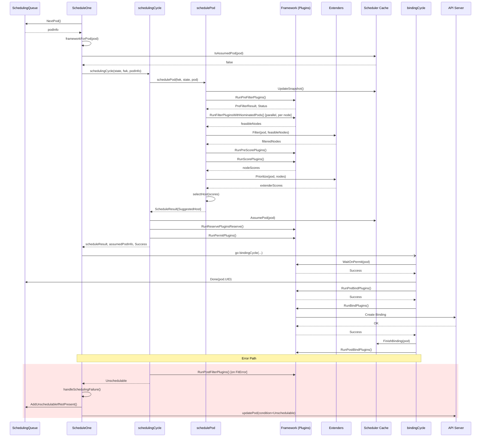

# Kubernetes Pod Scheduling — `ScheduleOne` Design Document

## 1. Overview

**Feature**: Pod Scheduling (single-pod scheduling workflow)

The `ScheduleOne` function is the top-level entry point for scheduling a single pod in the Kubernetes scheduler. It orchestrates the entire lifecycle of a scheduling attempt: retrieving the next unscheduled pod from the queue, finding a suitable node through filtering and scoring, assuming the pod is placed on a node (optimistic concurrency), running reserve/permit plugins, and finally binding the pod to the chosen node asynchronously. It is called in a loop by the scheduler's main `Run` goroutine.

- **Entry point**: scheduler, schedule_one.go, `func (sched *Scheduler) ScheduleOne(ctx context.Context)`
- **Purpose**: Execute the complete scheduling workflow for one pod — from dequeue to bind — coordinating the scheduling framework's extension points.

## 2. Architecture Diagram

```mermaid
graph TD
    subgraph "Scheduler Core"
        Scheduler["Scheduler struct"]
        ScheduleOne["ScheduleOne()"]
        SchedulingCycle["schedulingCycle()"]
        BindingCycle["bindingCycle()"]
        SchedulePod["schedulePod()"]
    end

    subgraph "Scheduling Framework"
        Framework["framework.Framework interface"]
        PreFilter["RunPreFilterPlugins()"]
        Filter["RunFilterPluginsWithNominatedPods()"]
        PostFilter["RunPostFilterPlugins()"]
        PreScore["RunPreScorePlugins()"]
        Score["RunScorePlugins()"]
        Reserve["RunReservePluginsReserve()"]
        Permit["RunPermitPlugins()"]
        WaitPermit["WaitOnPermit()"]
        PreBind["RunPreBindPlugins()"]
        Bind["RunBindPlugins()"]
        PostBind["RunPostBindPlugins()"]
    end

    subgraph "Backend"
        Cache["internalcache.Cache"]
        Queue["internalqueue.SchedulingQueue"]
        Snapshot["internalcache.Snapshot"]
    end

    subgraph "Extenders"
        Extender["framework.Extender"]
        ExtFilter["Extender.Filter()"]
        ExtPrioritize["Extender.Prioritize()"]
        ExtBind["Extender.Bind()"]
    end

    Scheduler --> ScheduleOne
    ScheduleOne --> SchedulingCycle
    ScheduleOne --> BindingCycle
    SchedulingCycle --> SchedulePod
    SchedulePod --> PreFilter
    SchedulePod --> Filter
    SchedulePod --> PreScore
    SchedulePod --> Score
    SchedulingCycle --> PostFilter
    SchedulingCycle --> Reserve
    SchedulingCycle --> Permit
    BindingCycle --> WaitPermit
    BindingCycle --> PreBind
    BindingCycle --> Bind
    BindingCycle --> PostBind
    SchedulePod --> ExtFilter
    SchedulePod --> ExtPrioritize
    BindingCycle --> ExtBind
    ScheduleOne --> Queue
    SchedulePod --> Snapshot
    SchedulingCycle --> Cache
```

## 3. Call Graph

```mermaid
graph TD
    classDef depth0 fill:#1a73e8,color:#fff,stroke:#1557b0
    classDef depth1 fill:#34a853,color:#fff,stroke:#2d8e47
    classDef depth2 fill:#fbbc04,color:#000,stroke:#d9a003
    classDef depth3 fill:#ea4335,color:#fff,stroke:#c5362e

    ScheduleOne["ScheduleOne()"]:::depth0

    subgraph "Depth 1 — Direct Calls"
        NextPod["NextPod()"]:::depth1
        frameworkForPod["frameworkForPod()"]:::depth1
        skipPodSchedule["skipPodSchedule()"]:::depth1
        schedulingCycle["schedulingCycle()"]:::depth1
        bindingCycle["bindingCycle()"]:::depth1
        handleSchedulingFailure["handleSchedulingFailure()"]:::depth1
        handleBindingCycleError["handleBindingCycleError()"]:::depth1
    end

    subgraph "Depth 2 — Scheduling Cycle"
        schedulePod["schedulePod()"]:::depth2
        assume["assume()"]:::depth2
        RunReserveReserve["Framework.RunReservePluginsReserve()"]:::depth2
        RunReserveUnreserve["Framework.RunReservePluginsUnreserve()"]:::depth2
        RunPermit["Framework.RunPermitPlugins()"]:::depth2
        RunPostFilter["Framework.RunPostFilterPlugins()"]:::depth2
        CacheForgetPod["Cache.ForgetPod()"]:::depth2
    end

    subgraph "Depth 2 — Binding Cycle"
        WaitOnPermit["Framework.WaitOnPermit()"]:::depth2
        RunPreBind["Framework.RunPreBindPlugins()"]:::depth2
        bind["bind()"]:::depth2
        RunPostBind["Framework.RunPostBindPlugins()"]:::depth2
        RunPreBindPreFlights["Framework.RunPreBindPreFlights()"]:::depth2
    end

    subgraph "Depth 3 — schedulePod internals"
        UpdateSnapshot["Cache.UpdateSnapshot()"]:::depth3
        findNodesThatFitPod["findNodesThatFitPod()"]:::depth3
        prioritizeNodes["prioritizeNodes()"]:::depth3
        selectHost["selectHost()"]:::depth3
    end

    subgraph "Depth 3 — findNodesThatFitPod internals"
        RunPreFilter["Framework.RunPreFilterPlugins()"]:::depth3
        findNodesThatPassFilters["findNodesThatPassFilters()"]:::depth3
        findNodesThatPassExtenders["findNodesThatPassExtenders()"]:::depth3
        evaluateNominatedNode["evaluateNominatedNode()"]:::depth3
    end

    subgraph "Depth 3 — prioritizeNodes internals"
        RunPreScore["Framework.RunPreScorePlugins()"]:::depth3
        RunScore["Framework.RunScorePlugins()"]:::depth3
        ExtPrioritize["Extender.Prioritize()"]:::depth3
    end

    subgraph "Depth 3 — bind internals"
        extendersBinding["extendersBinding()"]:::depth3
        RunBindPlugins["Framework.RunBindPlugins()"]:::depth3
        finishBinding["finishBinding()"]:::depth3
    end

    subgraph "Depth 3 — assume internals"
        CacheAssumePod["Cache.AssumePod()"]:::depth3
        DeleteNominatedPod["Queue.DeleteNominatedPodIfExists()"]:::depth3
    end

    ScheduleOne --> NextPod
    ScheduleOne --> frameworkForPod
    ScheduleOne --> skipPodSchedule
    ScheduleOne --> schedulingCycle
    ScheduleOne --> bindingCycle
    ScheduleOne --> handleSchedulingFailure
    ScheduleOne --> handleBindingCycleError

    schedulingCycle --> schedulePod
    schedulingCycle --> assume
    schedulingCycle --> RunReserveReserve
    schedulingCycle --> RunReserveUnreserve
    schedulingCycle --> RunPermit
    schedulingCycle --> RunPostFilter
    schedulingCycle --> CacheForgetPod

    bindingCycle --> RunPreBindPreFlights
    bindingCycle --> WaitOnPermit
    bindingCycle --> RunPreBind
    bindingCycle --> bind
    bindingCycle --> RunPostBind

    schedulePod --> UpdateSnapshot
    schedulePod --> findNodesThatFitPod
    schedulePod --> prioritizeNodes
    schedulePod --> selectHost

    findNodesThatFitPod --> RunPreFilter
    findNodesThatFitPod --> findNodesThatPassFilters
    findNodesThatFitPod --> findNodesThatPassExtenders
    findNodesThatFitPod --> evaluateNominatedNode

    prioritizeNodes --> RunPreScore
    prioritizeNodes --> RunScore
    prioritizeNodes --> ExtPrioritize

    bind --> extendersBinding
    bind --> RunBindPlugins
    bind --> finishBinding

    assume --> CacheAssumePod
    assume --> DeleteNominatedPod
```

## 4. Detailed Flow

### Depth 0: `ScheduleOne`

**Signature**: `func (sched *Scheduler) ScheduleOne(ctx context.Context)`
**Purpose**: Orchestrates the full scheduling workflow for a single pod.

**Logic flow**:
1. Call `sched.NextPod(logger)` to dequeue the next pod from the scheduling queue (blocks until available)
2. Nil-check the returned `podInfo` — return if queue is closed
3. Call `sched.frameworkForPod(pod)` to resolve the scheduling profile (Framework) from `pod.Spec.SchedulerName`
4. Call `sched.skipPodSchedule(ctx, fwk, pod)` — skip if pod is being deleted or already assumed
5. Create a new `CycleState`, randomly enable plugin metrics sampling
6. Initialize `podsToActivate` and write to cycle state
7. Create a cancellable context for the scheduling cycle
8. **Synchronously** call `sched.schedulingCycle(...)` — filtering, scoring, reserve, permit
9. On failure: call `sched.FailureHandler(...)` and return
10. On success: **asynchronously** (goroutine) call `sched.bindingCycle(...)` — wait-on-permit, prebind, bind, postbind
11. On binding failure: call `sched.handleBindingCycleError(...)`

**Key decisions**:
- Scheduling cycle is synchronous; binding cycle runs in a separate goroutine for pipeline parallelism
- Pod metrics sampling is randomized (10% of cycles) for performance

---

### Depth 1: `schedulingCycle`

**Signature**: `func (sched *Scheduler) schedulingCycle(ctx, state, schedFramework, podInfo, start, podsToActivate) (ScheduleResult, *QueuedPodInfo, *Status)`
**Purpose**: Runs the synchronous scheduling cycle — find a node, assume, reserve, permit.

**Logic flow**:
1. Call `sched.SchedulePod(ctx, schedFramework, state, pod)` to find a feasible node
2. On `ErrNoNodesAvailable`: return `UnschedulableAndUnresolvable` status
3. On `FitError`: run `schedFramework.RunPostFilterPlugins(...)` for preemption; return `Unschedulable`
4. On other errors: return error status
5. On success: record `SchedulingAlgorithmLatency` metric
6. Deep-copy podInfo, call `sched.assume(...)` to optimistically add pod→node to cache
7. Call `schedFramework.RunReservePluginsReserve(...)` — on failure, unreserve and forget
8. Call `schedFramework.RunPermitPlugins(...)` — on rejection, unreserve and forget
9. If `podsToActivate` is non-empty, call `sched.SchedulingQueue.Activate(...)`
10. Return `scheduleResult` and assumed pod info

**Called functions** (depth 2):
- `sched.SchedulePod()` → `schedulePod()` — find a node
- `sched.assume()` — cache the pod as assumed
- `Framework.RunReservePluginsReserve()` — reserve resources
- `Framework.RunPermitPlugins()` — permit check
- `Framework.RunPostFilterPlugins()` — preemption (on failure path)

---

### Depth 1: `bindingCycle`

**Signature**: `func (sched *Scheduler) bindingCycle(ctx, state, schedFramework, scheduleResult, assumedPodInfo, start, podsToActivate) *Status`
**Purpose**: Runs the asynchronous binding cycle — wait on permit, prebind, bind, postbind.

**Logic flow**:
1. If `NominatedNodeNameForExpectation` is enabled:
   - Run `schedFramework.RunPreBindPreFlights(...)` 
   - If preflight passes or will wait on permit, call `updatePod(...)` to set `NominatedNodeName`
2. Call `schedFramework.WaitOnPermit(...)` — blocks if permit returned "Wait"
3. On permit rejection: return `FitError`
4. Call `sched.SchedulingQueue.Done(pod.UID)` — free cluster events
5. Call `schedFramework.RunPreBindPlugins(...)` — pre-bind checks
6. Call `sched.bind(...)` — extender binding or framework bind plugins
7. Log success, record metrics (`PodScheduled`, `PodSchedulingAttempts`, `PodSchedulingSLIDuration`)
8. Call `schedFramework.RunPostBindPlugins(...)` — post-bind hooks
9. If `podsToActivate` non-empty, call `sched.SchedulingQueue.Activate(...)`

**Called functions** (depth 2):
- `Framework.WaitOnPermit()` — block on pending permits
- `Framework.RunPreBindPlugins()` — pre-bind validation
- `sched.bind()` — bind pod to node
- `Framework.RunPostBindPlugins()` — post-bind notification

---

### Depth 1: `frameworkForPod`

**Signature**: `func (sched *Scheduler) frameworkForPod(pod *v1.Pod) (framework.Framework, error)`
**Purpose**: Looks up the scheduling profile (Framework) for a pod by its `SchedulerName`.

**Logic flow**:
1. Look up `sched.Profiles[pod.Spec.SchedulerName]` 
2. Return error if profile not found

---

### Depth 1: `skipPodSchedule`

**Signature**: `func (sched *Scheduler) skipPodSchedule(ctx, fwk, pod) bool`
**Purpose**: Checks if scheduling should be skipped for this pod.

**Logic flow**:
1. If `pod.DeletionTimestamp != nil` → skip (pod is being deleted)
2. If `sched.Cache.IsAssumedPod(pod)` → skip (pod was re-queued but already assumed)

---

### Depth 1: `handleSchedulingFailure`

**Signature**: `func (sched *Scheduler) handleSchedulingFailure(ctx, fwk, podInfo, status, nominatingInfo, start)`
**Purpose**: Records events/metrics and re-queues the pod on scheduling failure.

**Logic flow**:
1. Determine reason: `Unschedulable` (rejected) or `SchedulerError`
2. Record `PodUnschedulable` or `PodScheduleError` metrics
3. Inject `UnschedulablePlugins`/`PendingPlugins` from `FitError` to `podInfo`
4. Check informer cache for the pod; if pod has `NodeName` set, skip re-queue
5. Otherwise call `sched.SchedulingQueue.AddUnschedulableIfNotPresent(...)` to re-queue
6. Call `sched.SchedulingQueue.AddNominatedPod(...)` with nominating info
7. Record `FailedScheduling` event and update pod condition via `updatePod(...)`

---

### Depth 1: `handleBindingCycleError`

**Signature**: `func (sched *Scheduler) handleBindingCycleError(ctx, state, fwk, podInfo, start, scheduleResult, status)`
**Purpose**: Cleans up after a binding cycle failure — unreserve, forget, re-queue.

**Logic flow**:
1. Call `fwk.RunReservePluginsUnreserve(...)` — release reserved resources
2. Call `sched.Cache.ForgetPod(...)` — remove assumed pod from cache
3. On success, call `sched.SchedulingQueue.MoveAllToActiveOrBackoffQueue(...)` to trigger re-scheduling of affected pods
4. Call `sched.FailureHandler(...)` to handle the failure

---

### Depth 2: `schedulePod`

**Signature**: `func (sched *Scheduler) schedulePod(ctx, fwk, state, pod) (ScheduleResult, error)`
**Purpose**: Core scheduling algorithm — snapshot, filter, score, select.

**Logic flow**:
1. Call `sched.Cache.UpdateSnapshot(...)` to refresh the node-info snapshot
2. If `NumNodes() == 0` → return `ErrNoNodesAvailable`
3. Call `sched.findNodesThatFitPod(...)` → get feasible nodes and diagnosis
4. If no feasible nodes → return `FitError`
5. If exactly one feasible node → return it directly (skip scoring)
6. Call `prioritizeNodes(...)` → score all feasible nodes
7. Call `selectHost(...)` → pick the highest-scored node via reservoir sampling
8. Return `ScheduleResult` with `SuggestedHost`, `EvaluatedNodes`, `FeasibleNodes`

---

### Depth 2: `assume`

**Signature**: `func (sched *Scheduler) assume(logger, assumed *v1.Pod, host string) error`
**Purpose**: Optimistically mark the pod as running on the selected node in the cache.

**Logic flow**:
1. Set `assumed.Spec.NodeName = host`
2. Call `sched.Cache.AssumePod(logger, assumed)` — add to cache as assumed
3. Call `sched.SchedulingQueue.DeleteNominatedPodIfExists(assumed)` — remove from nominated

---

### Depth 2: `bind`

**Signature**: `func (sched *Scheduler) bind(ctx, schedFramework, assumed, targetNode, state) *Status`
**Purpose**: Binds the pod to the node via extenders or framework bind plugins.

**Logic flow**:
1. Defer `sched.finishBinding(...)` — finalize cache binding state and record event
2. Call `sched.extendersBinding(...)` — try extender binding first
3. If no extender handled it, call `schedFramework.RunBindPlugins(...)` — framework bind

---

### Depth 3 (signatures and purpose only):

| Function | Purpose |
|----------|---------|
| `findNodesThatFitPod()` | Runs PreFilter, Filter plugins, and extender filters to find feasible nodes |
| `findNodesThatPassFilters()` | Runs Filter plugins in parallel across nodes, stops early when enough feasible nodes found |
| `findNodesThatPassExtenders()` | Runs extender Filter sequentially, removing unfeasible nodes |
| `evaluateNominatedNode()` | Fast-path: tries the nominated node first before scanning all nodes |
| `prioritizeNodes()` | Runs PreScore, Score plugins, and extender Prioritize to rank feasible nodes |
| `selectHost()` | Picks the highest-scored node using a max-heap with reservoir sampling for tie-breaking |
| `numFeasibleNodesToFind()` | Calculates how many nodes to evaluate based on cluster size and `percentageOfNodesToScore` |
| `extendersBinding()` | Iterates extenders to find one that handles binding |
| `finishBinding()` | Calls `Cache.FinishBinding()` and records the `Scheduled` event |
| `updatePod()` | Patches pod status (condition + nominated node name) via API cacher or direct API call |
| `Cache.AssumePod()` | Adds pod to cache in "assumed" state |
| `Cache.UpdateSnapshot()` | Refreshes the scheduler's per-cycle snapshot of node info |
| `Framework.RunPreFilterPlugins()` | Runs PreFilter plugins to compute per-pod pre-processing and node constraints |
| `Framework.RunFilterPluginsWithNominatedPods()` | Runs Filter plugins on a node, considering nominated pods |
| `Framework.RunPreScorePlugins()` | Runs PreScore plugins to prepare for scoring |
| `Framework.RunScorePlugins()` | Runs Score plugins to rank nodes |
| `Framework.RunBindPlugins()` | Runs Bind plugins (default: `DefaultBinder` creates a `Binding` object) |

## 5. Sequence Diagram

## 6. Key Data Structures

| Type | Package | Purpose |
|------|---------|---------|
| `Scheduler` | scheduler | Main scheduler struct. Holds `Cache`, `Profiles`, `SchedulingQueue`, `Extenders`, `NextPod`, `SchedulePod`, `FailureHandler` |
| `ScheduleResult` | scheduler | Result of scheduling: `SuggestedHost`, `EvaluatedNodes`, `FeasibleNodes`, `nominatingInfo` |
| `QueuedPodInfo` | framework | Pod wrapper with scheduling metadata: `Attempts`, `InitialAttemptTimestamp`, `UnschedulablePlugins`, `PendingPlugins` |
| `CycleState` | `k8s.io/kube-scheduler/framework` | Per-cycle key-value store shared across plugins; thread-safe for concurrent reads |
| `Framework` | framework | Interface for all scheduling extension points (PreFilter → PostBind) |
| `Diagnosis` | framework | Diagnostic info from filtering: `NodeToStatus`, `UnschedulablePlugins`, `PreFilterMsg`, `PostFilterMsg` |
| `FitError` | framework | Error when no node fits: contains `Diagnosis` with per-node status and plugin info |
| `NodePluginScores` | framework | Per-node scoring result: `Name`, `Scores []PluginScore`, `TotalScore` |
| `NominatingInfo` | framework | Nominating metadata: `NominatedNodeName`, `NominatingMode` |
| `PodsToActivate` | framework | Map of pods that should be moved to active queue at end of cycle |
| `Extender` | framework | Interface for out-of-process scheduling extenders: `Filter()`, `Prioritize()`, `Bind()` |
| `Cache` | cache | Node/pod state cache with assume/forget/confirm lifecycle |
| `SchedulingQueue` | queue | Priority queue with active/backoff/unschedulable sub-queues |

## 7. Extension Points

The scheduling framework defines the following plugin extension points, all invoked within `ScheduleOne`:

| Extension Point | Phase | Invoked In | Purpose |
|----------------|-------|------------|---------|
| **PreFilter** | Scheduling | `findNodesThatFitPod` | Per-pod preprocessing; can reject pod or constrain node set |
| **Filter** | Scheduling | `findNodesThatPassFilters` | Per-node feasibility check (runs in parallel) |
| **PostFilter** | Scheduling | `schedulingCycle` (error path) | Preemption; runs when no node is feasible |
| **PreScore** | Scheduling | `prioritizeNodes` | Prepare state for scoring |
| **Score** | Scheduling | `prioritizeNodes` | Score each feasible node |
| **Reserve** | Scheduling | `schedulingCycle` | Reserve resources for the pod (reversible) |
| **Permit** | Scheduling | `schedulingCycle` | Approve, deny, or delay (Wait) binding |
| **PreBind** | Binding | `bindingCycle` | Pre-binding operations (e.g., provision PV) |
| **Bind** | Binding | `bind` | Create the API binding object |
| **PostBind** | Binding | `bindingCycle` | Post-binding notification (informational) |

**Extender extension points** (out-of-process, HTTP webhooks):
- `Filter` — additional node filtering
- `Prioritize` — additional node scoring (runs in parallel goroutines)
- `Bind` — alternative bind mechanism (takes precedence over framework Bind plugins)

## 8. Summary Table

| Aspect | Details |
|--------|---------|
| Entry Point | `(*Scheduler).ScheduleOne(ctx context.Context)` |
| Key Packages | scheduler, framework, cache, queue, parallelize, metrics |
| Concurrency | Scheduling cycle is synchronous; binding cycle runs in a goroutine. Filter plugins run in parallel via `Parallelizer.Until()` with `atomic.AddInt32` for node counting. Extender Prioritize runs in parallel goroutines with `sync.WaitGroup` + `sync.Mutex`. |
| Extension Points | PreFilter, Filter, PostFilter, PreScore, Score, Reserve, Permit, PreBind, Bind, PostBind — plus Extender Filter/Prioritize/Bind |
| Error Handling | `FitError` triggers PostFilter (preemption) → re-queue to unschedulable pool. Binding failures trigger Unreserve + ForgetPod + re-queue. Pod condition updated via API. All errors result in `FailedScheduling` event. |
| Metrics | `SchedulingAlgorithmLatency`, `PodScheduled`, `PodUnschedulable`, `PodScheduleError`, `PodSchedulingAttempts`, `PodSchedulingSLIDuration`, `FrameworkExtensionPointDuration`, `Goroutines` |
