## Assume Pattern in Kubernetes Scheduler (with Diagrams)

### What It Is

The **Assume pattern** is a critical optimization in Kubernetes's scheduler that **pre-commits pod placements in memory before the API confirms them**. It's the scheduler's way of saying: "I've decided this pod goes on node X, so let me immediately reflect that in my cache—don't wait for the API server to confirm it."

### Pod State Machine

### Scheduling Workflow Timeline

```mermaid
sequenceDiagram
    participant Scheduler
    participant Cache
    participant API Server

    Scheduler->>Scheduler: Decision: Pod A → Node 1
    Scheduler->>Cache: AssumePod(Pod A, Node 1)
    activate Cache
    Cache->>Cache: Update Node 1 capacity<br/>(subtract Pod A resources)
    Cache-->>Scheduler: ✓ assumed
    deactivate Cache

    par Parallel Processing
        Scheduler->>Scheduler: Schedule Pod B<br/>(use cache with Pod A's usage)
        Scheduler->>Scheduler: Schedule Pod C<br/>(continue...)
        
        Scheduler->>API Server: Binding Request for Pod A<br/>(async, non-blocking)
        activate API Server
    end

    Scheduler->>Scheduler: Schedule Pod D<br/>(all use fresh cache)

    API Server->>Cache: Pod Added Event (Pod A confirmed)
    activate Cache
    Cache->>Cache: Convert Assumed → Added state<br/>(was already accounted for)
    Cache-->>Scheduler: ✓ confirmed
    deactivate Cache
    deactivate API Server
```

### Failure Scenario

### Cache State Comparison

### The Core Methods Flow

```mermaid
graph LR
    A["🚀 SchedulePod<br/>Makes decision"]
    
    B["AssumePod()<br/>Optimistic commit<br/>to cache"]
    
    C{"Binding in<br/>API Server"}
    
    D["AddPod()<br/>Confirms<br/>assumption"]
    
    E["ForgetPod()<br/>Rolls back<br/>assumption"]
    
    F["FinishBinding()<br/>Marks binding<br/>complete"]
    
    A --> B
    B --> C
    C -->|Success| D
    C -->|Failure| E
    D --> F
    E --> A
    
    style B fill:#90EE90
    style D fill:#87CEEB
    style E fill:#FFB6C6
    style F fill:#FFD700
```

### Problem It Solves

| Aspect | Without Assume | With Assume |
|--------|---|---|
| **Throughput** | ~50 pods/sec | ~1000+ pods/sec |
| **Bottleneck** | API latency (10-100ms) | CPU-bound scheduling |
| **Cache Accuracy** | Stale during binding | Up-to-date during binding |
| **Double-booking** | Yes (if binding slow) | No (cached immediately) |
| **Example Timeline** | Schedule → Wait 50ms → Next pod | Schedule → Assume → Schedule (parallel) |

### Detailed Flow: 3 Pods in Sequence

### Key Invariant: State Expiration

---

**Summary**: The Assume pattern decouples the **logical scheduling decision** (cache update) from the **physical API confirmation** (binding), preventing head-of-line blocking and achieving **20x throughput improvement** in pod scheduling.