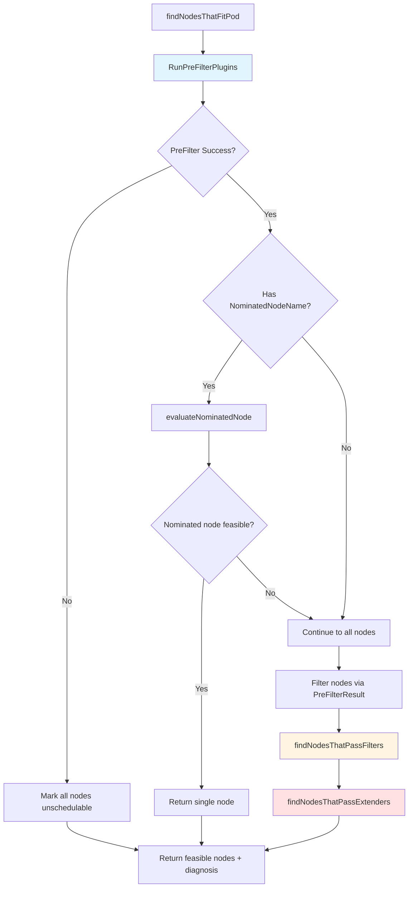
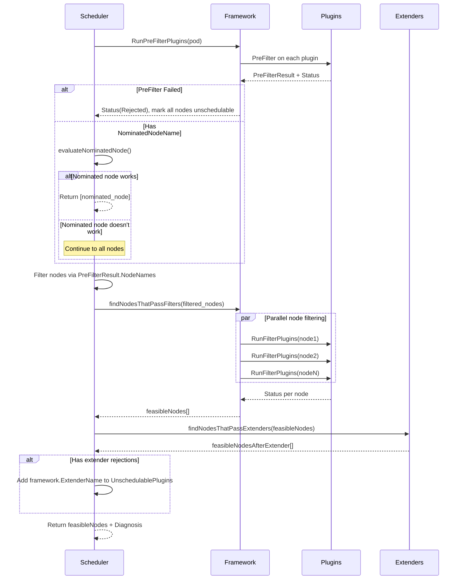

# `findNodesThatFitPod` Method Deep Dive

## Purpose

Finds all nodes in the cluster that can host the given pod by running filter plugins and extenders. This is the **feasibility check** phase of scheduling.

## High-Level Flow



## Detailed Execution Steps

### 1. **PreFilter Phase**

```go
preRes, s, unscheduledPlugins := schedFramework.RunPreFilterPlugins(ctx, state, pod)
diagnosis.UnschedulablePlugins = unscheduledPlugins
```

**What happens**: Plugins perform **cluster-wide** checks before examining individual nodes.

**Examples**:
- `PodTopologySpread`: Calculates pod distribution across topology domains
- `VolumeBinding`: Checks if required PVCs exist and are available
- `NodeAffinity`: Pre-processes node selector terms

**Critical behavior**: If PreFilter returns `Rejected`:
```go
if !s.IsSuccess() {
    if !s.IsRejected() {
        return nil, diagnosis, s.AsError()  // Hard error (cluster issue)
    }
    // Soft rejection - all nodes marked with same status
    diagnosis.NodeToStatus.SetAbsentNodesStatus(s)
    return nil, diagnosis, nil  // Early exit, pod is unschedulable
}
```

**Why early exit?** No point checking individual nodes if a cluster-wide constraint already failed (e.g., no PVC exists).

---

### 2. **Nominated Node Fast Path**

```go
if len(pod.Status.NominatedNodeName) > 0 {
    feasibleNodes, err := sched.evaluateNominatedNode(ctx, pod, schedFramework, state, diagnosis)
    if len(feasibleNodes) != 0 {
        return feasibleNodes, diagnosis, nil  // Fast path success!
    }
}
```

**Context**: After **preemption** in a previous cycle, the scheduler sets `NominatedNodeName` on the pod.

**Why try it first?**
- Preemption already evicted lower-priority pods from this node
- High probability it's the **only** node that will fit
- Avoids scanning all ~10,000 nodes if we already know the answer

**Gotcha**: If the nominated node doesn't work (e.g., another scheduler bound a pod there), we **don't fail**—we fall through to normal node scanning.

---

### 3. **Node Subset Selection (PreFilterResult)**

```go
nodes := allNodes
if !preRes.AllNodes() {
    nodes = make([]fwk.NodeInfo, 0, len(preRes.NodeNames))
    for nodeName := range preRes.NodeNames {
        // Only include nodes that passed PreFilter
    }
}
```

**Optimization**: PreFilter plugins can **narrow down** the candidate set.

**Example**: 
- `NodeAffinity` PreFilter finds nodes matching `nodeSelector`
- If pod requires GPU nodes, only check those 100 nodes instead of 10,000

**Absent nodes handling**:
```go
diagnosis.NodeToStatus.SetAbsentNodesStatus(
    fwk.NewStatus(fwk.UnschedulableAndUnresolvable, 
        fmt.Sprintf("node(s) didn't satisfy plugin(s) %v", sets.List(unscheduledPlugins))))
```

Nodes **not** in `preRes.NodeNames` are marked as failed PreFilter (even though we never explicitly checked them).

---

### 4. **Filter Phase**

```go
feasibleNodes, err := sched.findNodesThatPassFilters(ctx, schedFramework, state, pod, &diagnosis, nodes)
```

This is where **per-node filtering** happens. Inside `findNodesThatPassFilters`:

```go
numNodesToFind := sched.numFeasibleNodesToFind(schedFramework.PercentageOfNodesToScore(), int32(numAllNodes))
```

**Key optimization**: Doesn't check **all** nodes—stops after finding `numNodesToFind` feasible nodes.

**Default calculation**:
- `PercentageOfNodesToScore` = 0 (auto-calculate)
- Auto mode: 50 nodes if cluster has ≤50 nodes, 10% if cluster has 5000 nodes
- Minimums: `minFeasibleNodesToFind=100`, `minFeasibleNodesPercentageToFind=5%`

**Why stop early?** 
- Finding 100 feasible nodes is enough for scoring phase to pick a good one
- Checking all 10,000 nodes adds latency with diminishing returns
- Trade-off: slight reduction in optimal placement for massive throughput gains

**Round-robin start point**:
```go
sched.nextStartNodeIndex = (sched.nextStartNodeIndex + processedNodes) % len(allNodes)
```

**Why?** Prevents always starting from node-0 (which would get overloaded). Each scheduling cycle starts from a different offset.

---

### 5. **Extender Phase**

```go
feasibleNodesAfterExtender, err := findNodesThatPassExtenders(ctx, sched.Extenders, pod, feasibleNodes, diagnosis.NodeToStatus)
```

**Extenders**: External HTTP webhooks for custom filtering logic (legacy extension point).

**Gotcha with extenders**:
```go
if len(feasibleNodesAfterExtender) != len(feasibleNodes) {
    // Extenders filtered out nodes but can't provide requeueing hints!
    diagnosis.UnschedulablePlugins.Insert(framework.ExtenderName)
}
```

**Why `framework.ExtenderName`?** Extenders are **black boxes**—they don't support `EnqueueExtensions` like framework plugins. If an extender rejects the pod, we conservatively requeue it for **any** cluster event (inefficient but safe).

---

## Key Data Structures

### `framework.Diagnosis`

```go
type Diagnosis struct {
    NodeToStatus           NodeToStatus           // Map: node name → filter failure status
    UnschedulablePlugins   sets.Set[string]       // Plugins that rejected the pod
    PreFilterMsg           string                 // Message from PreFilter rejection
    // ...
}
```

**Purpose**: Collects **why** a pod didn't fit on each node. Used for:
1. Error messages to users
2. Preemption decisions (avoid preempting pods if it won't help)
3. Queue reactivation hints

### `NodeToStatus`

Stores per-node filter results:
```go
// Example after filtering 3 nodes:
NodeToStatus = {
    "node-1": Status{Code: Success},
    "node-2": Status{Code: Unschedulable, Message: "Insufficient cpu"},
    "node-3": Status{Code: UnschedulableAndUnresolvable, Message: "Node selector mismatch"},
}
```

**Status codes**:
- `Success`: Node passed all filters
- `Unschedulable`: Might work after preemption (e.g., CPU shortage)
- `UnschedulableAndUnresolvable`: Cannot be fixed by preemption (e.g., node selector mismatch, taint without toleration)

---

## Performance Optimizations

### 1. **Early Termination**
- PreFilter rejection → skip all nodes
- Nominated node success → skip all other nodes
- Found enough feasible nodes → stop filtering

### 2. **Parallel Filtering**
Inside `findNodesThatPassFilters`, nodes are checked in parallel:
```go
parallelize.Until(ctx, len(nodes), func(i int) {
    schedFramework.RunFilterPlugins(ctx, state, pod, nodeInfo)
})
```

Uses worker pool with concurrency = min(16, num_nodes).

### 3. **Smart Node Ordering**
```go
sched.nextStartNodeIndex = (sched.nextStartNodeIndex + processedNodes) % len(allNodes)
```

Distributes load across nodes over time.

---

## Error Handling & Gotchas

### Gotcha 1: Nominated Node Errors are Silent

```go
if len(pod.Status.NominatedNodeName) > 0 {
    feasibleNodes, err := sched.evaluateNominatedNode(...)
    if err != nil {
        utilruntime.HandleErrorWithContext(ctx, err, "Evaluation failed on nominated node", ...)
        // ⚠️ ERROR IS LOGGED BUT IGNORED - continues to scan all nodes
    }
}
```

**Why?** The nominated node is a **hint**, not a requirement. If it fails (node deleted, resources changed), just try other nodes.

### Gotcha 2: PreFilterResult Can Return Non-Existent Nodes

```go
for nodeName := range preRes.NodeNames {
    // PreRes may return nodeName(s) which do not exist; we verify
    // node exists in the Snapshot.
}
```

**Why?** Plugin might have stale data or bugs. Silently skip missing nodes instead of crashing.

### Gotcha 3: Empty Result vs Error

```go
if len(feasibleNodes) == 0 {
    // Caller (schedulePod) converts this to &framework.FitError
    return nil, diagnosis, nil  // No error, just no feasible nodes
}
```

**Distinction**:
- `error != nil`: System failure (cache corruption, timeout). Retry immediately.
- `error == nil, len(feasibleNodes)==0`: No nodes fit. Run PostFilter (preemption), then retry.

---

## Complete Flow Diagram



---

## Real-World Impact

**Scenario: 10,000 node cluster, pod with `nodeSelector`**

Without optimizations:
- Check all 10,000 nodes → ~1 second per pod
- Throughput: ~50-100 pods/sec

With optimizations:
- PreFilter narrows to 500 GPU nodes
- Check 100 nodes (10% of 500, min threshold)
- Round-robin start prevents hotspotting
- Time: ~100ms per pod
- Throughput: ~1000+ pods/sec

**The difference**: PreFilter + early termination + parallelization enable Kubernetes to schedule **10x more pods/sec** at scale.
