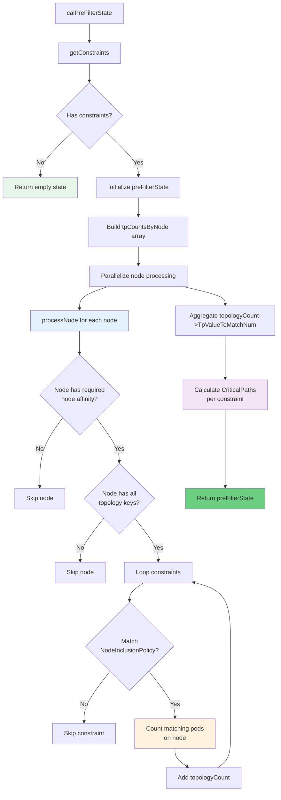
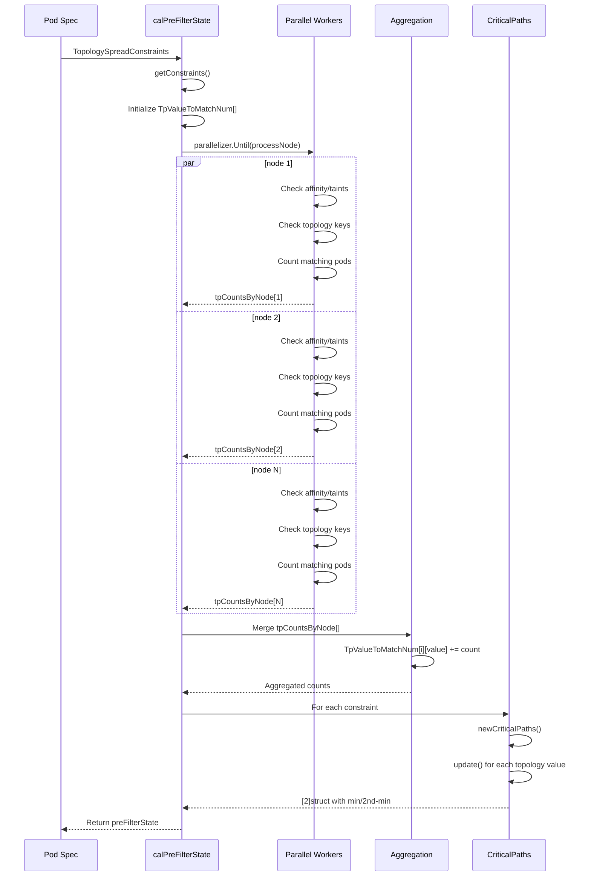
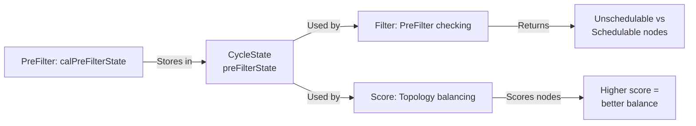

# `PodTopologySpread.calPreFilterState` Deep Dive

## Purpose

Calculates the **PreFilter state** for pod topology spread constraints by analyzing current pod distribution across topology domains. This data powers subsequent filter and scoring decisions.

## High-Level Flow



## Detailed Execution Breaking Down

### 1. **Constraint Extraction**

```go
constraints, err := pl.getConstraints(pod)
if err != nil {
    return nil, fmt.Errorf("get constraints from pod: %w", err)
}
if len(constraints) == 0 {
    return &preFilterState{}, nil
}
```

**What happens**: Extracts topology spread constraints from pod spec.

**Two sources**:
- **Explicit**: `pod.Spec.TopologySpreadConstraints` (if specified)
- **Implicit/Default**: Auto-generated constraints if not specified (via `buildDefaultConstraints`)

**Default constraints behavior** (when no explicit constraints):
```go
// Default: spread evenly across topology.kubernetes.io/zone
// and kubernetes.io/hostname
```

**Error handling**: Early return with wrapped error if constraint parsing fails.

---

### 2. **State Initialization**

```go
s := preFilterState{
    Constraints:       constraints,                    // Store parsed constraints
    CriticalPaths:     make([]*criticalPaths, len(constraints)),
    TpValueToMatchNum: make([]map[string]int, len(constraints)),
}
for i := 0; i < len(constraints); i++ {
    s.TpValueToMatchNum[i] = make(map[string]int, sizeHeuristic(len(allNodes), constraints[i]))
}
```

**Pre-allocation strategy**:

```go
func sizeHeuristic(nodes int, constraint topologySpreadConstraint) int {
	if constraint.TopologyKey == v1.LabelHostname {
		return nodes  // Each node has unique hostname
	}
	return 0  // Zone/custom keys: unknown in advance, grow as needed
}
```

**Why this heuristic?**
- **Hostname key**: Each node is a unique topology value → allocate capacity for all nodes
- **Zone key**: Multiple nodes share same zone → map grows dynamically (0 pre-allocation)

**Memory optimization**: Avoids over-allocating for zone topology (e.g., 10,000 nodes × 50 zones = only 50 entries needed).

---

### 3. **Node Affinity Resolution**

```go
requiredNodeAffinity := nodeaffinity.GetRequiredNodeAffinity(pod)
```

**What's captured**:

```go
type RequiredNodeAffinity struct {
    labelSelector labels.Selector          // From pod.Spec.NodeSelector
    nodeSelector  *LazyErrorNodeSelector   // From pod.Spec.Affinity.NodeAffinity.Required...
}
```

**Why extract upfront?** Reuse across all nodes in parallel processing without recalculating.

---

### 4. **Parallel Node Processing** (Critical optimization)

```go
tpCountsByNode := make([][]topologyCount, len(allNodes))

processNode := func(n int) {
    nodeInfo := allNodes[n]
    node := nodeInfo.Node()
    // ... filtering and counting logic
    tpCountsByNode[n] = tpCounts
}

pl.parallelizer.Until(ctx, len(allNodes), processNode, pl.Name())
```

**Parallelization details**:
- Worker pool processes nodes concurrently
- Default parallelism: 16 workers
- Chunk-based work distribution to minimize context switching
- Each worker independently computes `tpCountsByNode[n]`

**Why parallel?** On 10,000 nodes, sequential processing would take seconds. Parallel reduces to hundreds of milliseconds.

---

### 5. **Node Filtering (Policy-Based)**

#### Step 5a: NodeInclusionPolicy (Backward compatibility gate)

```go
if !pl.enableNodeInclusionPolicyInPodTopologySpread {
    // Old behavior: apply node affinity globally
    if match, _ := requiredNodeAffinity.Match(node); !match {
        return  // Skip this node entirely
    }
}
```

**Feature gate**: Controls whether `NodeInclusionPolicy` is respected.

**Old behavior** (gate disabled):
- All nodes must satisfy pod's required node affinity
- If pod has `nodeSelector: {zone: us-east}`, skip all other zones

**New behavior** (gate enabled):
- Per-constraint `NodeInclusionPolicy` controls affinity/taint respect
- Different constraints can have different policies

---

#### Step 5b: Topology Key Existence Check

```go
if !nodeLabelsMatchSpreadConstraints(node.Labels, constraints) {
    return  // Node missing required topology keys
}
```

**What it checks**:

```go
func nodeLabelsMatchSpreadConstraints(nodeLabels map[string]string, constraints []topologySpreadConstraint) bool {
	for _, c := range constraints {
		if _, ok := nodeLabels[c.TopologyKey]; !ok {
			return false  // Node missing topology key
		}
	}
	return true
}
```

**Example**:
```yaml
constraints:
  - topologyKey: topology.kubernetes.io/zone
  - topologyKey: kubernetes.io/hostname

node.Labels:
  topology.kubernetes.io/zone: us-east-1a
  kubernetes.io/hostname: node-1
  # Both keys present ✓
```

**Why skip if missing?** Can't count pods on this node for a topology key it doesn't have.

---

#### Step 5c: Per-Constraint NodeInclusionPolicy

```go
for i, c := range constraints {
    if pl.enableNodeInclusionPolicyInPodTopologySpread &&
        !c.matchNodeInclusionPolicies(pod, node, requiredNodeAffinity) {
        continue  // Skip this constraint for this node
    }
    
    // Process constraint...
}
```

**matchNodeInclusionPolicies logic**:

```go
func (tsc *topologySpreadConstraint) matchNodeInclusionPolicies(pod *v1.Pod, node *v1.Node, require nodeaffinity.RequiredNodeAffinity) bool {
	if tsc.NodeAffinityPolicy == v1.NodeInclusionPolicyHonor {
		// Respect pod's required node affinity
		if match, _ := require.Match(node); !match {
			return false  // Node doesn't satisfy affinity
		}
	}

	if tsc.NodeTaintsPolicy == v1.NodeInclusionPolicyHonor {
		// Respect pod's tolerations
		if _, untolerated := v1helper.FindMatchingUntoleratedTaint(...); untolerated {
			return false  // Node has untolerated taint
		}
	}
	return true
}
```

**Policy options**:
- `NodeInclusionPolicyHonor`: Enforce the constraint (require affinity match, no untolerated taints)
- `NodeInclusionPolicyIgnore`: Skip the constraint (consider all nodes)

**Use case**: Pod has `nodeSelector: gpu=true` but one constraint wants to spread across **all** nodes, not just GPU nodes.

---

### 6. **Pod Counting (Matching Logic)**

```go
value := node.Labels[c.TopologyKey]  // e.g., "us-east-1a"
count := countPodsMatchSelector(nodeInfo.GetPods(), c.Selector, pod.Namespace)
tpCounts = append(tpCounts, topologyCount{
    topologyValue: value,
    constraintID:  i,
    count:         count,
})
```

**countPodsMatchSelector logic**:

```go
func countPodsMatchSelector(podInfos []fwk.PodInfo, selector labels.Selector, ns string) int {
	if selector.Empty() {
		return 0  // No selector = count 0
	}
	count := 0
	for _, p := range podInfos {
		// Skip terminating pods (being deleted)
		if p.GetPod().DeletionTimestamp != nil {
			continue
		}
		// Only count pods in same namespace
		if p.GetPod().Namespace != ns {
			continue
		}
		// Check if pod labels match constraint's selector
		if selector.Matches(labels.Set(p.GetPod().Labels)) {
			count++
		}
	}
	return count
}
```

**Key details**:
- **DeletionTimestamp check**: Exclude terminating pods (they're leaving anyway)
- **Namespace filtering**: Only count pods in the pod's namespace
- **Empty selector**: Returns 0 (no pods match empty selector)

**Example**:
```yaml
constraint:
  selector:
    matchLabels:
      app: web

node "us-east-1a" pods:
  - name: web-1, namespace: default, labels: {app: web} ✓ (count++)
  - name: web-2, namespace: default, labels: {app: web} ✓ (count++)
  - name: db-1, namespace: default, labels: {app: db} ✗ (different label)
  - name: web-3, namespace: other, labels: {app: web} ✗ (different ns)

count = 2
```

---

### 7. **Aggregation: Per-Node → Per-Topology-Value**

```go
for _, tpCounts := range tpCountsByNode {
    for _, tpCount := range tpCounts {
        s.TpValueToMatchNum[tpCount.constraintID][tpCount.topologyValue] += tpCount.count
    }
}
```

**Transformation**:

```
Before (per-node):
  tpCountsByNode[0] = [{topologyValue: "us-east-1a", constraintID: 0, count: 2}, ...]
  tpCountsByNode[1] = [{topologyValue: "us-east-1a", constraintID: 0, count: 3}, ...]

After (aggregated):
  TpValueToMatchNum[0]["us-east-1a"] = 2 + 3 = 5
  TpValueToMatchNum[0]["us-west-1a"] = ...
```

**Why this transformation?**
- **Input**: Parallel worker results (per-node counts)
- **Output**: Aggregated counts per topology value (used in Filter/Score phases)

---

### 8. **Critical Paths Calculation**

```go
for i := 0; i < len(constraints); i++ {
    s.CriticalPaths[i] = newCriticalPaths()
    
    for value, num := range s.TpValueToMatchNum[i] {
        s.CriticalPaths[i].update(value, num)
    }
}
```

**Critical paths tracking** (stores only **2** minimum paths):

```go
type criticalPaths [2]struct {
    TopologyValue string  // e.g., "us-east-1a"
    MatchNum      int     // Pod count in that topology
}

// Invariant:
// CriticalPaths[0].MatchNum <= CriticalPaths[1].MatchNum (with some exceptions)
```

**Why only track 2 paths?**

Memory optimization: Instead of storing all topology values (could be 100+ zones), store only the 2 with **minimum** pod counts. During scheduling, these are the "critical paths" to balance.

**Update logic**:

```go
func (p *criticalPaths) update(tpVal string, num int) {
	i := -1
	if tpVal == p[0].TopologyValue {
		i = 0
	} else if tpVal == p[1].TopologyValue {
		i = 1
	}

	if i >= 0 {
		// Existing path: update count
		p[i].MatchNum = num
		// Keep p[0] as minimum
		if p[0].MatchNum > p[1].MatchNum {
			p[0], p[1] = p[1], p[0]
		}
	} else {
		// New path: insert if better than current top-2
		if num < p[0].MatchNum {
			// New minimum: demote current p[0] to p[1]
			p[1] = p[0]
			p[0] = struct{TopologyValue: tpVal, MatchNum: num}
		} else if num < p[1].MatchNum {
			// Between current min and max
			p[1] = struct{TopologyValue: tpVal, MatchNum: num}
		}
		// If num >= both, ignore (not in top-2)
	}
}
```

**Example evolution**:

```
Initial: [{MatchNum: MaxInt32}, {MatchNum: MaxInt32}]

update("us-east-1a", 5):
  → [{us-east-1a: 5}, {MaxInt32: MaxInt32}]

update("us-west-1a", 3):
  → [{us-west-1a: 3}, {us-east-1a: 5}]  (3 < 5, swap)

update("eu-west-1a", 10):
  → [{us-west-1a: 3}, {us-east-1a: 5}]  (10 > 5, ignored)

update("ap-south-1a", 4):
  → [{us-west-1a: 3}, {ap-south-1a: 4}]  (4 is between 3 and 5)
```

**Result**: At the end, we know which 2 topology values are least populated, and we can use this data during Filter/Score to balance pod placement.

---

## Complete Data Flow Diagram



---

## Performance Characteristics

| Phase | Complexity | Notes |
|-------|-----------|-------|
| getConstraints | O(C) | C = # constraints (usually 1-2) |
| Initialize maps | O(C × nodes or C × zones) | Depends on heuristic |
| Parallel node processing | O(N × P × F) | N=nodes, P=avg pods/node, F=constraint complexity; parallelized over workers |
| Aggregation | O(N × C × Z) | N=nodes, C=constraints, Z=avg zones; linear scan |
| CriticalPaths calc | O(C × Z) | C=constraints, Z=unique topology values |
| **Total** | **O(N × P × F + C × Z)** | Dominated by parallel node processing |

**Real-world example** (10,000 node cluster):
- Node processing: ~100-200ms (parallelized with 16 workers)
- Aggregation: ~10ms
- CriticalPaths: ~1ms
- **Total**: ~120-210ms

---

## Gotchas & Edge Cases

### Gotcha 1: DeletionTimestamp Silently Excludes Terminating Pods

```go
if p.GetPod().DeletionTimestamp != nil {
    continue  // Silently skip
}
```

**Implication**: Pod being deleted isn't counted toward topology spread. If you delete 10 pods, topology suddenly shows lighter load—new pods get scheduled there immediately.

**Why?** Terminating pods are leaving anyway, so counting them is misleading.

---

### Gotcha 2: Empty Selector Means Zero Pods Match

```go
if selector.Empty() {
    return 0  // Not "all pods", just 0
}
```

**Common mistake**: Thinking `selector.Empty()` means "all pods". It actually means "no selector specified" → match 0 pods.

**Correct logic**: To match all pods in namespace, use `matchLabels: {}` or `matchExpressions: []` (explicit empty).

---

### Gotcha 3: CriticalPaths Only Stores 2 Topology Values

```go
CriticalPaths[i] [2]struct  // Only 2, not all
```

**Implication**: If there are 100 zones, you're only tracking the 2 least populated. During Filter phase, decisions are based on these 2, not all 100.

**Why acceptable?** Pod topology spread goal is to **balance**, not spread perfectly across all zones. Having 2 critical paths is enough for balancing logic.

---

### Gotcha 4: Parallel Processing Results Race on tpCountsByNode Write

```go
pl.parallelizer.Until(ctx, len(allNodes), processNode, ...)
```

**Design avoids race**: Each `processNode(n)` writes to `tpCountsByNode[n]` only—no shared writes.

**Key insight**: `n` (array index) is unique per goroutine, so no mutex needed.

---

### Gotcha 5: NodeInclusionPolicy Feature Gate Creates Two Behaviors

```go
if !pl.enableNodeInclusionPolicyInPodTopologySpread {
    // Old: global affinity check
} else {
    // New: per-constraint policy
}
```

**Implication**: Upgrading cluster changes schedulability. Old cluster + gate enabled = different node filtering.

---

## Relationship to Other Phases



**Data flow**:
1. **PreFilter** (this function): Calculates `TpValueToMatchNum` and `CriticalPaths`
2. **Filter**: Uses `CriticalPaths` to reject pods violating hard constraints
3. **Score**: Uses `TpValueToMatchNum` to prefer nodes that improve balance

---

## Real-World Example

**Scenario**: 3-zone cluster, pod with default topology spread (spread across zones)

```
Initial state:
  us-east-1a: 100 pods
  us-west-1a: 50 pods
  eu-west-1a: 30 pods

calPreFilterState() output:
  TpValueToMatchNum[0]:
    "us-east-1a": 100
    "us-west-1a": 50
    "eu-west-1a": 30
  
  CriticalPaths[0]:
    [0]: {TopologyValue: "eu-west-1a", MatchNum: 30}
    [1]: {TopologyValue: "us-west-1a", MatchNum: 50}

Filter phase:
  → Pod MUST be scheduled in eu-west-1a (minimum path)
  → Otherwise pod violates maxSkew

Score phase:
  → eu-west-1a zone = highest score (pull pods here)
```

**Result**: Next pod scheduled in eu-west-1a, bringing it to 31 pods. Cluster gradually balances across zones.