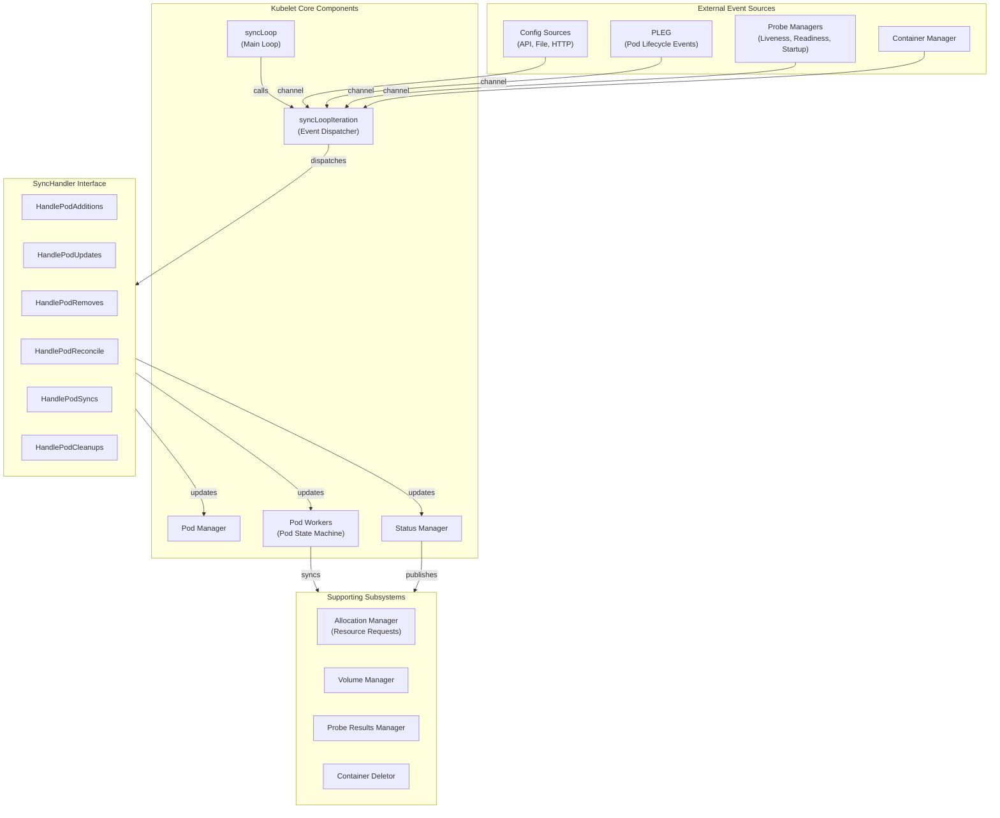
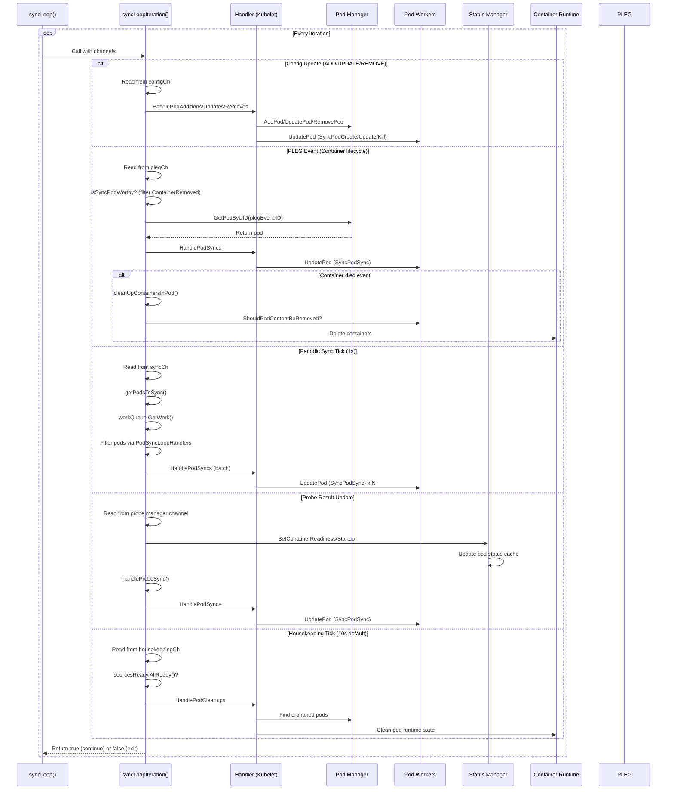

# Kubernetes syncLoopIteration Feature Analysis & Design Document

## Overview

**Feature**: Kubernetes Kubelet Main Synchronization Loop - Event Dispatcher  
**Entry Point**: kubelet.go - `func (kl *Kubelet) syncLoopIteration(...) bool`

The `syncLoopIteration` function is the core event dispatcher within the kubelet's main synchronization loop. It listens to multiple independent event channels representing different sources of pod state changes (config updates, PLEG events, periodic syncs, probe results, container manager events, and housekeeping triggers) and dispatches pod work to handlers. This function implements a non-blocking, pseudo-random priority receive pattern using Go's `select` statement, ensuring responsive handling of diverse, concurrent pod lifecycle events without starving any single event source.

**Role in Architecture**: The function serves as the central hub that bridges multiple subsystems (pod manager, container runtime via PLEG, probe managers, status manager, and the pod workers) into a unified, event-driven pod orchestration workflow.

---

## Architecture Diagram



---

## Call Graph (Depth 0-3)

```mermaid
graph TD
    SyncLoopIter["syncLoopIteration<br/>Config Dispatch & Channel Mux"]
    
    subgraph Depth1["Depth 1: Direct Calls from syncLoopIteration"]
        HandlePodAdd["handler.HandlePodAdditions"]
        HandlePodUpdate["handler.HandlePodUpdates"]
        HandlePodRemove["handler.HandlePodRemoves"]
        HandlePodReconcile["handler.HandlePodReconcile"]
        HandlePodSync["handler.HandlePodSyncs"]
        IsSyncPodWorthy["isSyncPodWorthy"]
        GetPodByUID1["podManager.GetPodByUID"]
        CleanUpContainers["cleanUpContainersInPod"]
        GetPodsToSync["getPodsToSync"]
        HandleProbeSync["handleProbeSync"]
        SetContainerReadiness["statusManager.SetContainerReadiness"]
        SetContainerStartup["statusManager.SetContainerStartup"]
        GetPodByUID2["podManager.GetPodByUID"]
        SourcesReady["sourcesReady.AllReady"]
        HandlePodCleanups["handler.HandlePodCleanups"]
    end
    
    subgraph Depth2["Depth 2: Functions Called by Depth 1"]
        GetAllPods["podManager.GetPods"]
        GetWorkQueue["workQueue.GetWork"]
        PodSyncHandler["podSyncLoopHandler.ShouldSync"]
        PodCacheGet["podCache.Get"]
        ShouldRemove["podWorkers.ShouldPodContentBeRemoved"]
        DeleteContainers["containerDeletor.deleteContainersInPod"]
        AddPodMgr["podManager.AddPod"]
        TrackPod["podCertificateManager.TrackPod"]
        GetPodMirror["podManager.GetPodAndMirrorPod"]
        UpdatePodWorker["podWorkers.UpdatePod"]
        AllocAdd["allocationManager.AddPod"]
        StatusSetPod["statusManager.SetPodStatus"]
    end
    
    subgraph Depth3["Depth 3: Supporting Operations"]
        PodManagerInternals["Pod Manager<br/>State Updates"]
        WorkQueueOps["Work Queue<br/>Dequeue Logic"]
        ContainerOps["Container<br/>Cleanup Operations"]
        AdmissionCheck["Admission<br/>Check Logic"]
    end
    
    SyncLoopIter --> HandlePodAdd
    SyncLoopIter --> HandlePodUpdate
    SyncLoopIter --> HandlePodRemove
    SyncLoopIter --> HandlePodReconcile
    SyncLoopIter --> HandlePodSync
    SyncLoopIter --> IsSyncPodWorthy
    SyncLoopIter --> GetPodByUID1
    SyncLoopIter --> CleanUpContainers
    SyncLoopIter --> GetPodsToSync
    SyncLoopIter --> HandleProbeSync
    SyncLoopIter --> SetContainerReadiness
    SyncLoopIter --> SetContainerStartup
    SyncLoopIter --> SourcesReady
    SyncLoopIter --> HandlePodCleanups
    
    HandlePodAdd --> AddPodMgr
    HandlePodAdd --> TrackPod
    HandlePodAdd --> GetPodMirror
    HandlePodAdd --> UpdatePodWorker
    HandlePodAdd --> AllocAdd
    
    HandlePodUpdate --> UpdatePodWorker
    
    HandlePodRemove --> GetPodMirror
    
    HandlePodSync --> GetPodMirror
    HandlePodSync --> UpdatePodWorker
    
    GetPodsToSync --> GetAllPods
    GetPodsToSync --> GetWorkQueue
    GetPodsToSync --> PodSyncHandler
    
    CleanUpContainers --> PodCacheGet
    CleanUpContainers --> ShouldRemove
    CleanUpContainers --> DeleteContainers
    
    HandleProbeSync --> GetPodByUID2
    HandleProbeSync --> HandlePodSync
    
    SetContainerReadiness --> StatusSetPod
    SetContainerStartup --> StatusSetPod
    
    GetAllPods --> PodManagerInternals
    GetWorkQueue --> WorkQueueOps
    DeleteContainers --> ContainerOps
    AllocAdd --> AdmissionCheck
    
    style SyncLoopIter fill:#ff9999
    style Depth1 fill:#ffcc99
    style Depth2 fill:#ffff99
    style Depth3 fill:#ccffcc
```



---

## Detailed Flow

### **Depth 0: syncLoopIteration Function**

**Function Signature**
```go
func (kl *Kubelet) syncLoopIteration(ctx context.Context, configCh <-chan kubetypes.PodUpdate, 
    handler SyncHandler, syncCh <-chan time.Time, housekeepingCh <-chan time.Time, 
    plegCh <-chan *pleg.PodLifecycleEvent) bool
```

**Purpose**: Dispatcher that reads from six independent event channels and routes pod state changes to appropriate handlers in a non-blocking, fair fashion. 

**Logic Flow**:

1. **Extract logger** from context for structured logging
2. **Execute select statement** with six cases (non-blocking receive on first available channel):
   - **Case 1 - Config Channel** (`configCh`): Pod configuration updates from sources
   - **Case 2 - PLEG Channel** (`plegCh`): Pod lifecycle events from runtime
   - **Case 3 - Sync Channel** (`syncCh`): Periodic sync ticker signals
   - **Case 4-6 - Probe Managers**: Liveness, readiness, and startup probe update channels
   - **Case 7 - Container Manager**: Device/resource allocation updates
   - **Case 8 - Housekeeping Channel** (`housekeepingCh`): Periodic cleanup trigger

3. **Return true** to continue loop, **false** to exit (only on configCh closure)

---

### **Depth 1: Direct Function Calls**

#### **1. Configuration Update Dispatch** (Case: configCh)

**caller**: `handler.HandlePodAdditions(pods []*v1.Pod)`  
**Purpose**: Process pods being added from config source  
**Logic**:
- Skip if channel is closed (return false to stop sync loop)
- Switch on PodOperation type: ADD, UPDATE, REMOVE, RECONCILE, DELETE, SET
- For each operation, call matching handler method
- Record source as ready: `kl.sourcesReady.AddSource(u.Source)`

**Called functions** (depth 1):
- `handler.HandlePodAdditions()`
- `handler.HandlePodUpdates()`
- `handler.HandlePodRemoves()`
- `handler.HandlePodReconcile()`
- `kl.sourcesReady.AddSource(source string)`

---

#### **2. PLEG Event Dispatch** (Case: plegCh)

**caller**: `isSyncPodWorthy(event *pleg.PodLifecycleEvent) bool`  
**Purpose**: Determine if PLEG event warrants pod sync (filters out ContainerRemoved)

**Logic**:
```go
// Check if event type is worth syncing (ContainerRemoved is filtered out)
if event.Type != pleg.ContainerRemoved {
    // Get pod from manager and sync
    if pod, ok := kl.podManager.GetPodByUID(e.ID); ok {
        handler.HandlePodSyncs([]*v1.Pod{pod})
    }
}
```

**Called functions**:
- `isSyncPodWorthy()` - returns true if event.Type != ContainerRemoved
- `kl.podManager.GetPodByUID(id)` - retrieve pod by UID
- `handler.HandlePodSyncs()` - dispatch pod for sync
- `kl.cleanUpContainersInPod(podID, containerID)` - cleanup on ContainerDied

---

#### **3. Periodic Sync Dispatch** (Case: syncCh)

**caller**: `kl.getPodsToSync() []*v1.Pod`  
**Purpose**: Gets all pods that are ready for sync (either from work queue or from PodSyncLoopHandlers)

**Logic**:
```go
// Get all pods from manager
allPods := kl.podManager.GetPods()
// Get pod UIDs with pending work
podUIDs := kl.workQueue.GetWork()
// Filter pods to sync: those in work queue or matching PodSyncLoopHandlers
for _, pod := range allPods {
    if isInWorkQueue(pod.UID) || podSyncLoopHandler.ShouldSync(pod) {
        podsToSync = append(podsToSync, pod)
    }
}
```

**Called functions**:
- `kl.getPodsToSync()` - aggregate pods needing sync
- `handler.HandlePodSyncs()` - dispatch pods for sync

---

#### **4. Probe Result Dispatch** (Cases: liveness/readiness/startup managers)

**caller**: `handleProbeSync(kl, update, handler, probe, status string)`  
**Purpose**: Route probe result updates to pod sync handler

**For Readiness/Startup**:
- Update status manager: `kl.statusManager.SetContainerReadiness()/SetContainerStartup()`
- Call `handleProbeSync()` to queue pod for sync

**Called functions**:
- `handleProbeSync()` - query pod manager and dispatch HandlePodSyncs
- `kl.statusManager.SetContainerReadiness()` / `SetContainerStartup()`

---

#### **5. Container Manager Device Updates** (Case: kl.containerManager.Updates())

**caller**: Iterates over pod UIDs from container manager event  
**Purpose**: Sync pods when device allocation/deallocation changes

**Logic**:
```go
// Get list of pod UIDs affected by device changes
for _, p := range update.PodUIDs {
    if pod, ok := kl.podManager.GetPodByUID(types.UID(p)); ok {
        pods = append(pods, pod)
    }
}
// Dispatch all affected pods for resync
if len(pods) > 0 {
    handler.HandlePodSyncs(pods)
}
```

**Called functions**:
- `kl.podManager.GetPodByUID()` - retrieve pod by UID
- `handler.HandlePodSyncs()` - dispatch pods for sync

---

#### **6. Housekeeping Dispatch** (Case: housekeepingCh)

**caller**: `handler.HandlePodCleanups(ctx context.Context) error`  
**Purpose**: Trigger cleanup of terminated/orphaned pods from runtime

**Logic**:
```go
// Check if all config sources are ready (safety check)
if !kl.sourcesReady.AllReady() {
    return // Skip cleanup if sources not ready
}
// Record timing and call cleanup handler
start := time.Now()
err := handler.HandlePodCleanups(ctx)
// Log warning if cleanup took too long
duration := time.Since(start)
if duration > housekeepingWarningDuration {
    logger.Error(...) // Warning log
}
```

**Called functions**:
- `kl.sourcesReady.AllReady()` - check config sources
- `handler.HandlePodCleanups()` - trigger pod cleanup

---

### **Depth 2: Handler Implementation Functions**

#### **HandlePodAdditions** (kubelet.go)

**Purpose**: Admit and queue new pods for initial setup

**Key Operations**:
1. Sort pods by creation time
2. Add each pod to pod manager: `kl.podManager.AddPod(pod)`
3. Track pod certificate: `kl.podCertificateManager.TrackPod()`
4. Get mirror pod if exists: `kl.podManager.GetPodAndMirrorPod()`
5. Check admission (allocation): `kl.allocationManager.AddPod()`
6. Queue pod worker for sync: `kl.podWorkers.UpdatePod(UpdateType: SyncPodCreate)`

**Depth 2 Calls**:
- `kl.podManager.AddPod()` - register desired pod
- `kl.podCertificateManager.TrackPod()` - certificate tracking
- `kl.podManager.GetPodAndMirrorPod()` - resolve pod pairs
- `kl.podWorkers.UpdatePod()` - queue pod work with SyncPodCreate type

---

#### **HandlePodUpdates** (kubelet.go)

**Purpose**: Process pod spec changes and resource resizing

**Key Operations**:
1. Update pod in manager: `kl.podManager.UpdatePod()`
2. Check for container resize operations
3. Handle in-place pod vertical scaling if enabled
4. Queue pod worker: `kl.podWorkers.UpdatePod(UpdateType: SyncPodUpdate)`

**Depth 2 Calls**:
- `kl.podManager.UpdatePod()` - update pod state
- `recordContainerResizeOperations()` - check for resizes
- `kl.allocationManager.UpdatePodFromAllocation()` - resource updates
- `kl.statusManager.ClearPodResizePendingCondition()` - clear resize conditions
- `kl.podWorkers.UpdatePod()` - queue pod work with SyncPodUpdate type

---

#### **HandlePodRemoves** (kubelet.go)

**Purpose**: Clean up pod state and request termination

**Key Operations**:
1. Forget pod certificate: `kl.podCertificateManager.ForgetPod()`
2. Remove from manager: `kl.podManager.RemovePod()`
3. Remove allocation: `kl.allocationManager.RemovePod()`
4. Call `kl.deletePod()` to queue termination

**Depth 2 Calls**:
- `kl.podCertificateManager.ForgetPod()` - cleanup certificates
- `kl.podManager.RemovePod()` - remove desired pod
- `kl.allocationManager.RemovePod()` - free resources
- `kl.deletePod()` - queue pod for termination

---

#### **HandlePodSyncs** (kubelet.go)

**Purpose**: Queue pods for reconciliation sync

**Key Operations**:
1. For each pod, get pod and mirror pod pair
2. Queue with SyncPodSync type

**Depth 2 Calls**:
- `kl.podManager.GetPodAndMirrorPod()` - resolve pod pairs
- `kl.podWorkers.UpdatePod()` - queue with SyncPodSync type

---

#### **getPodsToSync** (kubelet.go)

**Purpose**: Aggregate pods needing sync from multiple sources

**Logic**:
```go
1. Get all pods from pod manager: GetPods()
2. Get work queue items: workQueue.GetWork() -> []*podUID
3. Create set of UIDs in work queue
4. Filter pods:
   - If UID in work queue -> add to sync list
   - Else if any PodSyncLoopHandler.ShouldSync(pod) -> add to sync list
```

**Depth 2 Calls**:
- `kl.podManager.GetPods()` - fetch desired pods
- `kl.workQueue.GetWork()` - fetch ready work items
- `podSyncLoopHandler.ShouldSync()` - check sync eligibility

---

#### **cleanUpContainersInPod** (kubelet.go)

**Purpose**: Delete dead containers in a pod (triggered by container death)

**Logic**:
```go
1. Get pod status from cache: podCache.Get(podID)
2. Check if pod content should be removed: podWorkers.ShouldPodContentBeRemoved(podID)
3. Delete containers: containerDeletor.deleteContainersInPod()
```

**Depth 2 Calls**:
- `kl.podCache.Get()` - get pod status
- `kl.podWorkers.ShouldPodContentBeRemoved()` - check removal eligibility
- `kl.containerDeletor.deleteContainersInPod()` - cleanup container logic

---

### **Depth 3: Core Data Structure Operations**

#### **Pod Manager Operations**
- `podManager.GetPods()` - Returns all desired pods managed by kubelet
- `podManager.GetPodByUID(uid)` - Lookup pod by unique identifier
- `podManager.GetPodAndMirrorPod(pod)` - Resolve static pod with mirror
- `podManager.AddPod(pod)` - Register new pod
- `podManager.UpdatePod(pod)` - Update existing pod state
- `podManager.RemovePod(pod)` - Deregister pod

#### **Work Queue Operations**
- `workQueue.GetWork()` - Dequeue all ready items (pods with scheduled work)
- Returns pod UIDs ready for immediate processing

#### **Pod Cache Operations**
- `podCache.Get(uid)` - Retrieve cached pod/container status
- Uses internal TTL-based cache with RWMutex protection

#### **Pod Workers Operations**
- `podWorkers.UpdatePod(options)` - Queue work for a pod with specific SyncType
- `podWorkers.ShouldPodContentBeRemoved(uid)` - Check if pod resources can be cleaned
- Routes work through separate goroutine per pod UID

---

## Sequence Diagram: Event Flow



---

## Key Data Structures

### **PodUpdate** (from config channels)
```go
type PodUpdate struct {
    Pods   []*v1.Pod           // Slice of pod objects
    Op     PodOperation        // ADD, UPDATE, REMOVE, RECONCILE, DELETE, SET
    Source string              // "api", "file", "http", "localhost"
}

type PodOperation int
const (
    ADD       PodOperation = iota
    UPDATE
    REMOVE
    RECONCILE
    DELETE
    SET
)
```

### **PodLifecycleEvent** (from PLEG)
```go
type PodLifecycleEvent struct {
    ID   types.UID              // Pod UID
    Type PodLifeCycleEventType  // ContainerStarted, ContainerStopped, ContainerDied, etc.
    Data interface{}            // Container name (string) for container events
}
```

### **UpdatePodOptions** (queue work item)
```go
type UpdatePodOptions struct {
    Pod        *v1.Pod          // Pod spec
    MirrorPod  *v1.Pod          // Mirror pod for static pods (optional)
    UpdateType kubetypes.SyncPodType // SyncPodSync, SyncPodCreate, SyncPodUpdate, SyncPodKill
    StartTime  time.Time         // Timestamp for latency metrics
}

type SyncPodType int
const (
    SyncPodSync SyncPodType = iota
    SyncPodUpdate
    SyncPodCreate
    SyncPodKill
)
```

### **ProbeResult Update** (from probe managers)
```go
type Update struct {
    PodUID      types.UID
    ContainerID kubecontainer.ContainerID
    Result      Result          // Success, Unknown, Failure
}
```

---

## Concurrency Patterns

### **Non-blocking Channel Receive**
- Uses `select` with pseudo-random evaluation order
- No channel blocks other channels (fair scheduling)
- One goroutine processes all syncLoopIteration calls
- Ensures no event source starves others

### **Goroutine Ownership**
- **syncLoop**: Main loop goroutine (one per kubelet)
- **syncLoopIteration**: Called synchronously from syncLoop
- **Pod workers**: Separate goroutine per pod UID (max worker count configured)
- **PLEG/Evented PLEG**: Background goroutines relisting/monitoring container runtime
- **Probe managers**: Background goroutines running health checks

### **Thread Safety**
- Pod manager uses RWMutex for concurrent reads/writes
- Work queue uses Mutex for dequeue operations
- Pod cache uses RWMutex for status lookups
- Pod workers use sync.Mutex per pod UID

### **Channel Delivery Guarantees**
- Blocking receive on configCh until source closes (error exit)
- Non-blocking receives on other channels (skip if empty)
- PLEG/probe channels are buffered to prevent send delays

---

## Extension Points

### **1. SyncHandler Interface**
```go
type SyncHandler interface {
    HandlePodAdditions(pods []*v1.Pod)
    HandlePodUpdates(pods []*v1.Pod)
    HandlePodRemoves(pods []*v1.Pod)
    HandlePodReconcile(pods []*v1.Pod)
    HandlePodSyncs(pods []*v1.Pod)
    HandlePodCleanups(ctx context.Context) error
}
```
- **Implemented by**: Kubelet (main implementation)
- **Extensibility**: Custom SyncHandler implementations can override pod dispatch logic
- **Used in**: All six handler calls in syncLoopIteration

### **2. PodSyncLoopHandler Interface**
```go
type PodSyncLoopHandler interface {
    ShouldSync(pod *v1.Pod) bool
}
```
- **Implemented by**: Multiple handlers (eviction manager, GC manager, etc.)
- **Purpose**: Determines if pod should enter sync loop on periodic tick
- **Used in**: `getPodsToSync()` to aggregate pods for periodic sync

### **3. SourcesReady Interface**
```go
type SourcesReady interface {
    AllReady() bool
    AddSource(source string)
}
```
- **Purpose**: Tracks which config sources have reported at least once
- **Used in**: Guard housekeeping from running before sources initialize
- **Extensibility**: Custom SourcesReadyFn can define initialization criteria

### **4. PodLifecycleEventGenerator (PLEG)**
```go
type PodLifecycleEventGenerator interface {
    Start()
    Watch() chan *PodLifecycleEvent
    Healthy() (bool, error)
    SetPodWatchCondition(podUID types.UID, conditionKey string, condition WatchCondition)
}
```
- **Implementations**: GenericPLEG, EventedPLEG (experimental)
- **Extensibility**: Custom PLEG implementations can feed pod events via channel

### **5. Probe Manager Updates**
```go
type Manager interface {
    Updates() <-chan Update  // Returns probe result channel
}
```
- **Implementations**: Liveness, Readiness, Startup probe managers
- **Extensibility**: Custom probe implementations via manager extension points

---

## Error Handling & Recovery

### **Configuration Channel Closure**
- Detect: `if !open` after receive from configCh
- Action: Return false to exit syncLoop (pod worker shutdown required)
- Impact: kubelet terminates cleanly

### **Pod Not Found**
- When PLEG/probe events refer to non-existent pods
- Action: Log and skip (pod may have been removed by then)
- No crash or error propagation

### **Housekeeping Failures**
- `HandlePodCleanups()` returns error
- Action: Log error, continue (retry on next housekeeping tick 10s later)
- Impact: Delayed cleanup but no sync loop blockage

### **Status Update Failures**
- `statusManager.SetContainerReadiness/Startup()` errors
- Action: Log and continue
- Recovery: Status manager retries on next update cycle

### **Probe Result Processing**
- Malformed probe updates filtered at manager level
- Action: Validate before processing, discard invalid
- Impact: No pod sync triggered if data corrupt

---

## Observability & Metrics

### **Logging**
- **Verbosity Level 1**: Probe sync events (high-level lifecycle changes)
- **Verbosity Level 2**: Pod operation dispatch (ADD/UPDATE/REMOVE)  
- **Verbosity Level 3**: Mirror pod operations, device updates
- **Verbosity Level 4**: PLEG events, periodic sync, housekeeping timing

### **Instrumentation**
- `kl.syncLoopMonitor`: Atomic timestamp of last loop entry (health check)
- **Metrics**: Sync latency (pod worker), health check duration (housekeeping)
- **Trace Context**: Propagated via `klog.FromContext(ctx)` for request tracing

### **Error Paths**
- Config channel closure logged as error with sync loop exit
- Invalid pod operations logged as errors
- Housekeeping duration warnings if > threshold
- Probe events skipped logged at debug level

---

## Summary Table

| Aspect | Details |
|--------|---------|
| **Entry Point** | kubelet.go - `syncLoopIteration()` method on `*Kubelet` |
| **Called From** | `syncLoop()` main loop (polling interval: 1 second for syncCh) |
| **Key Packages** | kubelet, pleg, prober, status, queue |
| **Concurrency Pattern** | Non-blocking select() with 8 case branches; one goroutine dispatcher + pod worker goroutines per UID |
| **State Management** | Pod manager (desired state), Pod workers (actual state), Pod cache (runtime status), Work queue (pending work) |
| **Extension Points** | SyncHandler interface (6 methods), PodSyncLoopHandler interface, SourcesReady interface, PLEG interface, Probe manager channels |
| **Error Handling** | Graceful degradation on missing pods; error logging; housekeeping retry on failure; no panic points |
| **Event Sources** | Config updates (file/API/HTTP), PLEG (container runtime), periodic ticks (sync/housekeep), probe results (3 managers), container manager (devices) |
| **Dispatch Strategy** | Multiplexed non-blocking dispatch to SyncHandler methods; pseudo-random fairness across 8 event sources |
| **Latency Sensitivity** | Critical path: < 1ms dispatch overhead; periodic tick avoids starvation; no blocking I/O in loop |
| **Kubernetes Version** | Stable interface since v1.5; EventedPLEG addition in later versions for low-latency event delivery |

---

## Design Insights

### **Why Non-Blocking Select?**
The pseudo-random channel priority prevents event source starvation. All event sources (config, runtime, probes, housekeeping) compete fairly for processing, preventing any single source from monopolizing the sync loop.

### **Separation of Dispatch and Execution**
`syncLoopIteration` is purely a dispatcher—it routes work to `SyncHandler` and pod workers, which execute asynchronously. This decouples event ingestion from work execution, enabling parallel pod processing.

### **Periodic Sync Safety Mechanism**
The `getPod sToSync()` with work queue + `PodSyncLoopHandler` provides two-level safety:
1. **Work queue**: Only pods with pending API server state changes
2. **Handlers**: Custom logic for eviction, garbage collection, quota management

### **Config Source Readiness Guard**
Before running `HandlePodCleanups`, the sync loop verifies all config sources (API, file, HTTP) have initialized. This prevents premature cleanup of pods not yet seen.

### **Mirror Pod Pattern**
Static pods are mirrored to the API server for visibility. `syncLoopIteration` handles pod-mirror pairs atomically, ensuring consistent state transitions.

Similar code found with 1 license type