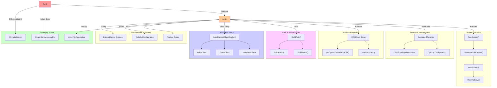
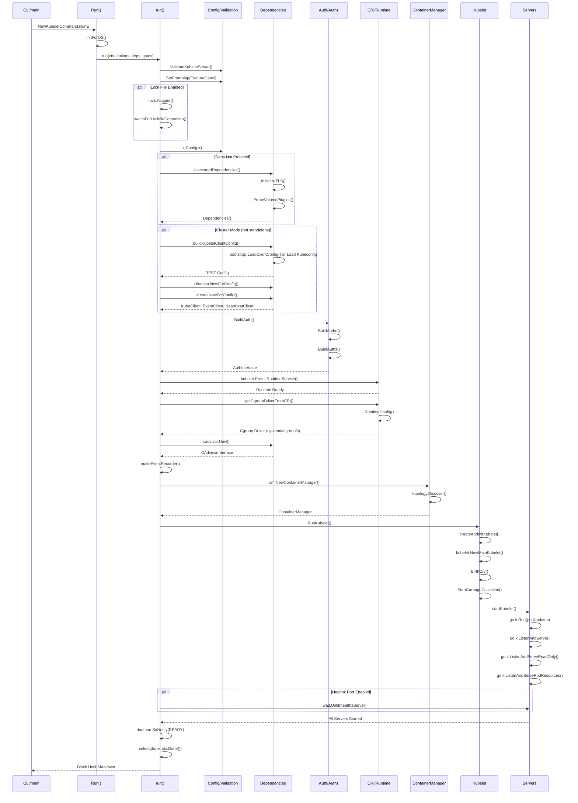

  

# Kubernetes Kubelet Server Initialization & Runtime Architecture

## Overview

The `Run()` function in [cmd/kubelet/app/server.go](cmd/kubelet/app/server.go#L526) is the entry point for launching a fully-initialized kubelet server. It orchestrates the complete bootstrap sequence: system initialization, dependency construction, API client setup, authentication/authorization, container runtime integration, resource management, and long-running server startup. The function performs OS-specific initialization and then delegates to the internal `run()` function for the bulk of the startup logic.

**Role in Kubernetes Architecture**: This function bridges the CLI execution (`NewKubeletCommand`) and the kubelet's core reconciliation loops. It transforms configuration files and flags into a running kubelet that can manage pods on a node, communicate with the API server, and continuously synchronize desired state with actual container state.

---

## Architecture Diagram



---

## Call Graph (Depth 0–3)

```mermaid
graph TD
    subgraph depth_0["Depth 0: Entry Point"]
        A["Run()"]
    end
    
    subgraph depth_1["Depth 1: Direct Calls"]
        B["initForOS()"]
        C["run()"]
    end
    
    subgraph depth_2["Depth 2: Secondary Calls"]
        D["watchdog.NewHealthChecker()"]
        E["watchdog.Start()"]
        F["utilfeature.SetFromMap()"]
        G["options.ValidateKubeletServer()"]
        H["flock.Acquire()"]
        I["watchForLockfileContention()"]
        J["initConfigz()"]
        K["UnsecuredDependencies()"]
        L["nodeutil.GetHostname()"]
        M["buildKubeletClientConfig()"]
        N["BuildAuth()"]
        O["kubelet.PreInitRuntimeService()"]
        P["getCgroupDriverFromCRI()"]
        Q["cm.NodeAllocatableRoot()"]
        R["cm.GetKubeletContainer()"]
        S["cadvisor.New()"]
        T["makeEventRecorder()"]
        U["cm.NewContainerManager()"]
        V["RunKubelet()"]
        W["wait.Until()"]
    end
    
    subgraph depth_3["Depth 3: Tertiary Calls"]
        X["klog.FromContext()"]
        Y["configz.New()"]
        Z["InitializeTLS()"]
        AA["ProbeVolumePlugins()"]
        AB["newTracerProvider()"]
        AC["kubelet.NewMainKubelet()"]
        AD["bootstrap.LoadClientConfig()"]
        AE["clientset.NewForConfig()"]
        AF["v1core.NewForConfig()"]
        AG["BuildAuthn()"]
        AH["BuildAuthz()"]
        AI["RemoteRuntimeService.RuntimeConfig()"]
        AJ["topology.Discover()"]
        AK["record.NewBroadcaster()"]
        AL["createAndInitKubelet()"]
        AM["startKubelet()"]
    end
    
    A --> B
    A --> C
    
    C --> D
    C --> E
    C --> F
    C --> G
    C --> H
    C --> I
    C --> J
    C --> K
    C --> L
    C --> M
    C --> N
    C --> O
    C --> P
    C --> Q
    C --> R
    C --> S
    C --> T
    C --> U
    C --> V
    C --> W
    
    D -.-> X
    J -.-> Y
    K -.-> Z
    K -.-> AA
    K -.-> AB
    M -.-> AD
    M -.-> AE
    M -.-> AF
    N -.-> AG
    N -.-> AH
    P -.-> AI
    P -.-> AJ
    T -.-> AK
    V -.-> AL
    V -.-> AM
    
    classDef d0 fill:#ff6666,stroke:#cc0000,stroke-width:3px,color:#fff
    classDef d1 fill:#ffcc66,stroke:#ff9900,stroke-width:2px,color:#000
    classDef d2 fill:#99ff99,stroke:#00cc00,stroke-width:2px,color:#000
    classDef d3 fill:#6699ff,stroke:#0000cc,stroke-width:1px,color:#fff
    
    class A d0
    class B,C d1
    class D,E,F,G,H,I,J,K,L,M,N,O,P,Q,R,S,T,U,V,W d2
    class X,Y,Z,AA,AB,AC,AD,AE,AF,AG,AH,AI,AJ,AK,AL,AM d3
```



---

## Detailed Flow

### Depth 0: Run() Function

**Signature**:
```go
func Run(ctx context.Context, s *options.KubeletServer, kubeDeps *kubelet.Dependencies, featureGate featuregate.FeatureGate) error
```

**Package**: `k8s.io/kubernetes/cmd/kubelet/app`  
**File**: server.go

**Purpose**: Public entry point that wraps OS-specific initialization before delegating to the core startup logic in `run()`.

**Logic Flow**:

1. Extract logger from context using `klog.FromContext(ctx)`
2. Log the kubelet version and Go runtime settings (GOGC, GOMAXPROCS, GOTRACEBACK) for debugging
3. Call `initForOS(ctx, s.WindowsService, s.WindowsPriorityClass)` to perform OS-specific setup:
   - On Windows: initializes Windows service and priority class
   - On others: no-op returning nil
4. Call `run(ctx, s, kubeDeps, featureGate)` to execute the main kubelet startup sequence
5. Wrap any error from `run()` with context and return

**Error Handling**:
- Returns error wrapping: `fmt.Errorf("failed OS init: %w", err)` or `fmt.Errorf("failed to run Kubelet: %w", err)`
- Errors in `initForOS` immediately halt startup
- Errors from `run()` propagate with wrapped context

**Called Functions**:
- `klog.FromContext()` → extract logger from context
- `initForOS()` → OS-specific initialization (Windows/Linux)
- `run()` → core kubelet startup logic

---

### Depth 1: run() Function

**Signature**:
```go
func run(ctx context.Context, s *options.KubeletServer, kubeDeps *kubelet.Dependencies, featureGate featuregate.FeatureGate) (err error)
```

**Package**: `k8s.io/kubernetes/cmd/kubelet/app`  
**File**: server.go

**Purpose**: Core initialization sequence that assembles all kubelet components, establishes API connectivity, configures resource management, and launches the main kubelet server and auxiliary services.

**Logic Flow**:

1. **Systemd Watchdog Setup** (feature-gated):
   - If `SystemdWatchdog` feature is enabled, call `watchdog.NewHealthChecker()` to create a systemd watchdog service
   - Start the health checker with `healthChecker.Start(ctx)` to monitor kubelet health

2. **Feature Gate Configuration**:
   - Set feature gates from `s.KubeletConfiguration.FeatureGates` using `utilfeature.DefaultMutableFeatureGate.SetFromMap()`
   - Validate the KubeletServer configuration with `options.ValidateKubeletServer(s)`

3. **Resource Configuration Warnings**:
   - Warn if MemoryQoS feature is enabled but cgroups v1 is detected (feature incompatible)
   - Check NodeSwap feature requirements for cgroup v2

4. **Lock File Acquisition** (optional):
   - If `s.LockFilePath` is specified, acquire an exclusive lock with `flock.Acquire()`
   - If `s.ExitOnLockContention` is true, watch for lock file contention via `watchForLockfileContention()`

5. **Configuration Registration**:
   - Register current kubelet configuration with the `/configz` endpoint via `initConfigz()`
   - Set hidden metrics visibility if `--show-hidden-metrics-for-version` is specified

6. **Mode Detection & Dependency Initialization**:
   - Detect standalone mode: `standaloneMode = len(s.KubeConfig) == 0`
   - If `kubeDeps` is nil, build defaults via `UnsecuredDependencies(ctx, s, featureGate)`

7. **Hostname & Node Name Resolution**:
   - Call `nodeutil.GetHostname(s.HostnameOverride)` to determine the node name
   - Convert to `types.NodeName` for downstream use

8. **API Client Setup** (conditional):
   - **Standalone Mode**: Set all API clients to nil
   - **Cluster Mode**: If any client is missing, build them via `buildKubeletClientConfig()`
     - Create `KubeClient` for general API operations with `clientset.NewForConfig()`
     - Create `EventClient` with throttled QPS/Burst settings via `v1core.NewForConfig()`
     - Create `HeartbeatClient` with status update frequency timeout via `clientset.NewForConfig()`
     - Register `OnHeartbeatFailure` callback to close idle connections on failures

9. **Authentication Setup**:
   - If `kubeDeps.Auth` is nil, build auth chain via `BuildAuth(nodeName, kubeDeps.KubeClient, s.KubeletConfiguration)`
   - This returns an auth handler and a CA reload function; start CA reload in background via `runAuthenticatorCAReload(ctx.Done())`

10. **Runtime Service Pre-initialization**:
    - Call `kubelet.PreInitRuntimeService(&s.KubeletConfiguration, kubeDeps)` to initialize CRI runtime before resource manager setup

11. **Cgroup Driver Configuration**:
    - Query CRI for cgroup driver preference via `getCgroupDriverFromCRI(ctx, s, kubeDeps)`
    - Fall back to config-specified driver if CRI doesn't support RuntimeConfig

12. **Cgroup Root Path Configuration**:
    - Build node allocatable root via `cm.NodeAllocatableRoot()`
    - Collect all cgroup root paths: node allocatable, kubelet, runtime, system cgroups

13. **cAdvisor Setup** (if not pre-provided):
    - Create image filesystem info provider via `cadvisor.NewImageFsInfoProvider()`
    - Initialize cAdvisor with `cadvisor.New()` for resource metrics and event generation

14. **Event Recorder Setup**:
    - Call `makeEventRecorder()` to set up event broadcasting to the API server

15. **ContainerManager Setup** (if not pre-provided):
    - Parse CPU/memory reservations: `parseResourceList(s.KubeReserved)`, `parseResourceList(s.SystemReserved)`
    - Discover reserved CPUs via `getReservedCPUs(machineInfo, s.ReservedSystemCPUs)`
    - Parse eviction thresholds via `eviction.ParseThresholdConfig()`
    - Create container manager via `cm.NewContainerManager()` with computed resource constraints

16. **Startup Latency Trackers**:
    - Initialize `PodStartupLatencyTracker` and `NodeStartupLatencyTracker` if not provided

17. **OOM Score Adjustment**:
    - Apply OOM adjuster score to the kubelet process itself via `kubeDeps.OOMAdjuster.ApplyOOMScoreAdj()`

18. **Main Kubelet Execution**:
    - Call `RunKubelet()` to create the main `Kubelet` instance and start reconciliation loops

19. **Auxiliary Server Setup**:
    - If `s.HealthzPort > 0`, start a healthz server in background via `wait.Until()` that listens on `--healthz-bind-address:--healthz-port`

20. **Systemd Notification**:
    - Notify systemd that the kubelet is ready via `daemon.SdNotify(false, "READY=1")`

21. **Blocking Wait**:
    - Select on `done` channel (from lock file watch) and `ctx.Done()` (shutdown signal)
    - Block until lock contention or shutdown signal

**Error Handling**:
- Validates configuration at each stage; errors immediately halt startup
- Retry logic: CRI RuntimeConfig call retries up to 3 times with 2-second delays
- OOM adjuster failures logged but don't halt startup
- Lock file errors are fatal

**Called Functions** (Depth 1 callers into Depth 2):
- `watchdog.NewHealthChecker()` → systemd watchdog setup
- `utilfeature.DefaultMutableFeatureGate.SetFromMap()` → apply feature gates
- `options.ValidateKubeletServer()` → validate configuration
- `flock.Acquire()` → lock file acquisition
- `watchForLockfileContention()` → monitor lock file (platform-specific)
- `initConfigz()` → register config endpoint
- `UnsecuredDependencies()` → build default dependencies
- `nodeutil.GetHostname()` → resolve node hostname
- `buildKubeletClientConfig()` → construct API client configuration
- `BuildAuth()` → build authentication/authorization handler
- `kubelet.PreInitRuntimeService()` → initialize CRI runtime
- `getCgroupDriverFromCRI()` → query CRI for cgroup driver
- `cm.NodeAllocatableRoot()`, `cm.GetKubeletContainer()` → compute cgroup paths
- `cadvisor.New()` → initialize metrics collection
- `makeEventRecorder()` → set up event broadcasting
- `cm.NewContainerManager()` → create resource constraint manager
- `RunKubelet()` → launch main kubelet
- `wait.Until()` → start healthz server
- `daemon.SdNotify()` → notify systemd

---

### Depth 2: Key Helper Functions

#### initConfigz()

**Signature**:
```go
func initConfigz(ctx context.Context, kc *kubeletconfiginternal.KubeletConfiguration) error
```

**Purpose**: Register the kubelet configuration with the `/configz` HTTP endpoint for inspection.

**Logic Flow**:
1. Create a new configz registry with name `"kubeletconfig"`
2. Convert internal KubeletConfiguration to versioned schema
3. Marshal to JSON and register with configz
4. Errors logged but non-fatal

**Called Functions**:
- `configz.New()` → create registry
- `kubeletscheme.NewSchemeAndCodecs()` → get codec
- `scheme.Convert()` → convert to versioned config
- `cz.Set()` → register config

---

#### UnsecuredDependencies()

**Signature**:
```go
func UnsecuredDependencies(ctx context.Context, s *options.KubeletServer, featureGate featuregate.FeatureGate) (*kubelet.Dependencies, error)
```

**Purpose**: Construct default `Dependencies` struct with all unsecured (non-client, non-auth) components.

**Logic Flow**:
1. Initialize TLS options via `InitializeTLS()`
2. Create mount utilities: `mount.New()` and `subpath.New()`
3. Create host utilities: `hostutil.NewHostUtil()`
4. Create command executor: `exec.New()`
5. Probe volume plugins via `ProbeVolumePlugins()`
6. Create tracer provider via `newTracerProvider()`
7. Assemble and return `kubelet.Dependencies` struct with all initialized fields

**Called Functions**:
- `InitializeTLS()` → TLS certificate setup/generation
- `mount.New()` → filesystem mount utilities
- `ProbeVolumePlugins()` → discover available volume plugins
- `newTracerProvider()` → create OpenTelemetry tracer provider

---

#### buildKubeletClientConfig()

**Signature**:
```go
func buildKubeletClientConfig(ctx context.Context, s *options.KubeletServer, tp oteltrace.TracerProvider, nodeName types.NodeName) (*restclient.Config, func(), error)
```

**Purpose**: Build REST client configuration for API server communication, supporting both client certificate rotation and bootstrap flows.

**Logic Flow**:

**If `s.RotateCertificates` is true** (client cert rotation enabled):
1. Load initial client config from kubeconfig/bootstrap kubeconfig via `bootstrap.LoadClientConfig()`
2. Build certificate manager via `buildClientCertificateManager()`
3. Register certificate TTL metric with Prometheus
4. Create rotating transport via `kubeletcertificate.UpdateTransport()` that auto-rotates certs
5. Set up `onHeartbeatFailure` callback:
   - If `DISABLE_HTTP2` env var set: close all idle connections via `closeAllConns`
   - Otherwise: close idle connections for specific transport

**Else if `s.BootstrapKubeconfig` is set** (bootstrap flow):
1. Load bootstrap cert into cert directory via `bootstrap.LoadClientCert()`
2. Fall through to standard config loading below

**Finally** (standard config loading):
1. Load kubeconfig file via `clientcmd.NewNonInteractiveDeferredLoadingClientConfig()`
2. Apply kubelet-specific config overrides via `kubeClientConfigOverrides()`
3. Set `onHeartbeatFailure` callback for idle connection cleanup

**Error Handling**:
- Validation errors return early
- Invalid kubeconfig paths return error with wrapped context
- Missing bootstrap kubeconfig returns error

**Called Functions**:
- `bootstrap.LoadClientConfig()` → load kubeconfig and bootstrap config
- `buildClientCertificateManager()` → create certificate manager for rotation
- `kubeletcertificate.UpdateTransport()` → wrap transport with cert rotation
- `clientcmd.NewNonInteractiveDeferredLoadingClientConfig()` → load kubeconfig
- `kubeClientConfigOverrides()` → apply kubelet-specific overrides

---

#### BuildAuth()

**Signature**:
```go
func BuildAuth(nodeName types.NodeName, client clientset.Interface, config kubeletconfig.KubeletConfiguration) (server.AuthInterface, func(<-chan struct{}), error)
```

**Purpose**: Construct the authentication and authorization chain for the kubelet server.

**Logic Flow**:
1. Extract authentication and authorization clients from `clientset`:
   - `client.AuthenticationV1()` → token review client
   - `client.AuthorizationV1()` → subject access review client
   - Nil if no client provided (standalone mode)

2. Build authenticator via `BuildAuthn()` with:
   - X.509 client CA file (optional)
   - Webhook token review (optional)
   - Anonymous access configuration
   - Cache TTL settings

3. Build authorization attributes getter via `server.NewNodeAuthorizerAttributesGetter(nodeName)`

4. Build authorizer via `BuildAuthz()` supporting:
   - `AlwaysAllow` mode
   - `Webhook` mode (SubjectAccessReview)
   - Returns error if mode empty or unknown

5. Compose into `server.NewKubeletAuth(authenticator, attributes, authorizer)`

6. Return auth handler, CA reload function, and any error

**Called Functions**:
- `BuildAuthn()` → build authenticator chain
- `BuildAuthz()` → build authorizer chain
- `server.NewKubeletAuth()` → compose auth handler
- `server.NewNodeAuthorizerAttributesGetter()` → create attributes getter

---

#### getCgroupDriverFromCRI()

**Signature**:
```go
func getCgroupDriverFromCRI(ctx context.Context, s *options.KubeletServer, kubeDeps *kubelet.Dependencies) error
```

**Purpose**: Query the CRI runtime for its cgroup driver preference and update kubelet config.

**Logic Flow**:
1. Call `kubeDeps.RemoteRuntimeService.RuntimeConfig(ctx)` to get runtime configuration
2. Retry up to 3 times with 2-second delays between attempts
3. Handle `Unimplemented` error code as non-transient (CRI doesn't support RuntimeConfig):
   - Register metric `CRILosingSupport`
   - Log fallback to config-file cgroup driver
   - Return nil (not fatal)
4. On transient errors: sleep 2 seconds and retry
5. Extract cgroup driver from response's Linux configuration:
   - `SYSTEMD` → set `s.CgroupDriver = "systemd"`
   - `CGROUPFS` → set `s.CgroupDriver = "cgroupfs"`
   - Unknown → return error
6. Log the updated cgroup driver setting

**Error Handling**:
- Retries transient errors
- Gracefully handles `Unimplemented` (older CRI runtimes)
- Returns error for truly fatal conditions

**Called Functions**:
- `RemoteRuntimeService.RuntimeConfig()` → gRPC call to CRI
- `status.FromError()` → parse gRPC error code
- `legacyregistry.MustRegister()` → register deprecation metric

---

#### RunKubelet()

**Signature**:
```go
func RunKubelet(ctx context.Context, kubeServer *options.KubeletServer, kubeDeps *kubelet.Dependencies) error
```

**Purpose**: Create and initialize the main `Kubelet` instance and start its servers.

**Logic Flow**:
1. Resolve hostname and node name via `nodeutil.GetHostname()`
2. Set up event recorder via `makeEventRecorder()`
3. Parse node IP arguments via `nodeutil.ParseNodeIPArgument()`
4. Initialize Linux capabilities via `capabilities.Initialize()`
5. Set credential provider path via `credentialprovider.SetPreferredDockercfgPath()`
6. Create main Kubelet instance via `createAndInitKubelet()` which calls `kubelet.NewMainKubelet()`
7. Verify pod config was initialized (must not be nil)
8. Set max open files limit via `rlimit.SetNumFiles()`
9. Start kubelet servers via `startKubelet()`:
   - Main pod sync loop: `k.Run(podCfg.Updates())`
   - HTTPS server: `k.ListenAndServe()` (if enabled)
   - Read-only HTTP server: `k.ListenAndServeReadOnly()` (if port > 0)
   - Pod resources API: `k.ListenAndServePodResources()`
10. Return nil (startup complete)

**Error Handling**:
- Node name resolution errors are fatal
- Node IP parsing errors are fatal
- Kubelet creation errors are fatal
- Config validation errors are fatal
- StartKubelet errors logged but don't halt (goroutines background tasks)

**Called Functions**:
- `nodeutil.GetHostname()` → resolve node name
- `makeEventRecorder()` → set up event broadcasting
- `nodeutil.ParseNodeIPArgument()` → parse node IP list
- `capabilities.Initialize()` → set Linux capabilities
- `createAndInitKubelet()` → instantiate main Kubelet
- `startKubelet()` → launch background server goroutines
- `rlimit.SetNumFiles()` → set resource limits

---

#### startKubelet()

**Signature**:
```go
func startKubelet(ctx context.Context, k kubelet.Bootstrap, podCfg *config.PodConfig, kubeCfg *kubeletconfiginternal.KubeletConfiguration, kubeDeps *kubelet.Dependencies, enableServer bool)
```

**Purpose**: Launch the kubelet's long-running reconciliation and server goroutines.

**Logic Flow**:
1. **Pod Sync Loop** (always started):
   - Launch goroutine: `go k.Run(podCfg.Updates())`
   - Watches for pod config updates and performs reconciliation

2. **HTTPS API Server** (conditional):
   - If `enableServer` is true:
   - Launch goroutine: `go k.ListenAndServe(kubeCfg, kubeDeps.TLSOptions, kubeDeps.Auth, kubeDeps.TracerProvider)`
   - Serves HTTPS endpoints for pod logs, metrics, debug actions

3. **Read-Only HTTP Server** (conditional):
   - If `kubeCfg.ReadOnlyPort > 0`:
   - Launch goroutine: `go k.ListenAndServeReadOnly(...)`
   - Serves read-only endpoints without authentication

4. **Pod Resources API Server** (always started):
   - Launch goroutine: `go k.ListenAndServePodResources(ctx)`
   - Serves CRI pod resources endpoint for device plugins

**Error Handling**:
- Background goroutines handle their own errors
- Panics in goroutines are caught by `utilruntime.HandleCrash()`
- Function itself returns immediately (non-blocking)

---

#### createAndInitKubelet()

**Signature**:
```go
func createAndInitKubelet(
    ctx context.Context,
    kubeServer *options.KubeletServer,
    kubeDeps *kubelet.Dependencies,
    hostname string,
    nodeName types.NodeName,
    nodeIPs []net.IP) (k kubelet.Bootstrap, err error)
```

**Purpose**: Instantiate and initialize a new `Kubelet` instance, triggering cascading initialization of all subsystems.

**Logic Flow**:
1. Call `kubelet.NewMainKubelet()` with full kubelet configuration and dependencies
2. Call `k.BirthCry()` to log node birth event and set up initial node state
3. Call `k.StartGarbageCollection()` to start container/image garbage collection
4. Return initialized kubelet instance

**Called Functions**:
- `kubelet.NewMainKubelet()` → create Kubelet struct (complex initialization)
- `kubelet.BirthCry()` → log node birth
- `kubelet.StartGarbageCollection()` → start GC goroutines

---

### Depth 3: Supporting Functions (Signatures & Purpose Only)

These are called by Depth 2 functions; listed for completeness:

| Function | File | Purpose |
|----------|------|---------|
| `InitializeTLS()` | server.go#1107 | Generate/load TLS certificates, configure cipher suites |
| `ProbeVolumePlugins()` | plugins.go#46 | Discover and register volume plugins from disk |
| `newTracerProvider()` | server.go#1355 | Create OpenTelemetry trace provider for distributed tracing |
| `kubelet.NewMainKubelet()` | kubelet/kubelet.go#415 | Complex Kubelet initialization (informers, sync loop setup) |
| `bootstrap.LoadClientConfig()` | client-go/bootstrap | Load initial kubeconfig and bootstrap config files |
| `clientset.NewForConfig()` | client-go | Create typed Kubernetes API client from config |
| `v1core.NewForConfig()` | client-go | Create core API v1 typed client |
| `BuildAuthn()` | auth.go#70 | Create authenticator chain (X.509, webhook, anonymous) |
| `BuildAuthz()` | auth.go#117 | Create authorizer (AlwaysAllow or webhook) |
| `kubelet.PreInitRuntimeService()` | kubelet.go | Initialize CRI runtime service before manager |
| `topology.Discover()` | scheduler/framework/plugins | Discover CPU topology from machine info |
| `record.NewBroadcaster()` | client-go/tools/record | Create event broadcaster |
| `cm.NewContainerManager()` | kubelet/cm | Create container resource manager with cgroup constraints |
| `wait.Until()` | client-go/util/wait | Periodic task runner for healthz server |

---

## Sequence Diagram



---

## Key Data Structures

### Dependencies struct (kubelet.Dependencies)

Core struct assembled by `UnsecuredDependencies()` and mutated during `run()`:

```go
type Dependencies struct {
    Auth                    server.AuthInterface              // Authentication/authorization handler
    CAdvisorInterface       cadvisor.Interface                // System metrics/events
    ContainerManager        cm.ContainerManager               // Resource constraint management
    KubeClient              clientset.Interface               // API server client
    HeartbeatClient         clientset.Interface               // Separate client for node leases
    EventClient             v1core.Interface                  // Separate client for events
    TracerProvider          trace.TracerProvider              // OpenTelemetry tracing
    HostUtil                hostutil.HostUtil                 // Host utilities (mount, device discovery)
    Mounter                 mount.Interface                   // Mount utilities
    Subpather               subpath.Interface                 // Subpath mount handler
    OOMAdjuster             oom.OOMAdjuster                   // Linux OOM killer tuning
    OSInterface             kubecontainer.OSInterface         // OS interface (process exec, signals)
    VolumePlugins           []volume.VolumePlugin             // Registered volume drivers
    DynamicPluginProber     DynamicPluginProber               // Device plugin discovery
    TLSOptions              *server.TLSOptions                // TLS cert paths and cipher config
    // ... plus many more fields
}
```

### KubeletConfiguration struct

Internal kubelet configuration (loaded from kubeconfig or /etc/kubernetes/kubelet/config.yaml):

```go
type KubeletConfiguration struct {
    // Node identity
    NodeName                        string
    HostnameOverride                string
    
    // API server communication
    KubeConfig                      string
    Kubeconfig                      string
    
    // Resource management
    MemorySwap                      MemorySwapConfiguration
    CgroupDriver                    string // "systemd" or "cgroupfs"
    CgroupRoot                      string
    KubeletCgroups                  string
    SystemCgroups                   string
    RuntimeCgroups                  string
    KubeReserved                    map[string]string
    SystemReserved                  map[string]string
    ReservedMemory                  []ReservedMemory
    ReservedSystemCPUs              string
    
    // TLS
    TLSCertFile                     string
    TLSPrivateKeyFile               string
    ServerTLSBootstrap              bool
    RotateCertificates              bool
    
    // Feature gates
    FeatureGates                    map[string]bool
    
    // Eviction
    EvictionHard                    map[string]evictionapi.Threshold
    EvictionSoft                    map[string]evictionapi.Threshold
    
    // Service ports
    HealthzPort                     int32
    HealthzBindAddress              string
    // ... plus many more fields
}
```

### KubeletServer struct (app options)

Command-line options and configuration:

```go
type KubeletServer struct {
    KubeletFlags            KubeletFlags
    KubeletConfiguration    kubeletconfig.KubeletConfiguration
}

type KubeletFlags struct {
    CertDirectory           string
    KubeletConfigFile       string
    KubeletDropinConfigDirectory string
    HostnameOverride        string
    NodeIP                  string
    RegisterNode            bool
    RegisterWithTaints      []v1.Taint
    CloudProvider           string
    ProviderID              string
    // ... plus many command-line flags
}
```

---

## Extension Points

### Plugin Interfaces

**Volume Plugins** (volume.go):
- ProbeVolumePlugins discovers plugins at kubelet startup
- New volume types registrable via plugin mechanism
- Example: CSI driver plugin integration

**Authorization Modes**:
- `AlwaysAllow`: Default, allows all requests
- `Webhook`: SubjectAccessReview to external authorizer
- Extensible via `authorizerfactory.DelegatingAuthorizerConfig`

**Authentication Methods**:
- X.509 client certificates
- ServiceAccount token webhook
- Anonymous access
- Extensible via `authenticatorfactory.DelegatingAuthenticatorConfig`

**Event Broadcasters**:
- Multiple backends supported: log, webhook
- `eventBroadcaster.StartRecordingToSink()` registers sink
- Allows custom event persistence

### Feature Gates

Experimental features controlled at startup via `--feature-gates` flag:
- `SystemdWatchdog`: Enables systemd watchdog integration
- `MemoryQoS`: Memory quality-of-service (cgroups v2 only)
- `TopologyManagerPolicyOptions`: Custom topology manager policies
- `NodeSwap`: Swap memory support
- And many others...

---

## Concurrency & Lifecycle Management

### Context Propagation

- `ctx context.Context` passed through entire initialization chain
- `genericapiserver.SetupSignalContext()` creates root context that cancels on SIGTERM/SIGINT
- All goroutines respect context cancellation via `select{<-ctx.Done()}`

### Goroutine Launch Pattern

All long-running services launched as background goroutines with panic recovery:

```go
go k.Run(podCfg.Updates())
go k.ListenAndServe(...)
go k.ListenAndServeReadOnly(...)
go wait.Until(func() { ... }, duration, wait.NeverStop)
```

Each goroutine internally uses `utilruntime.HandleCrash()` for panic recovery.

### Lock File Contention Handling

If `--exit-on-lock-contention` is set:
- `flock.Acquire()` blocks on file lock
- `watchForLockfileContention()` (Linux) uses inotify to detect lock file changes
- When lock contention detected, kubelet exits gracefully

### Shutdown Sequence

1. Signal received (SIGTERM/SIGINT) → `ctx.Done()` fires
2. `Run()` unblocks from `select{<-done, <-ctx.Done()}`
3. Returns nil (graceful shutdown)
4. All background goroutines observe `ctx.Done()` and exit

---

## Error Handling Strategy

| Category | Handling | Impact |
|----------|----------|--------|
| **Configuration** | Validate early, fail immediately | Halts startup |
| **OS Initialization** | Return error | Halts startup |
| **Lock File** | Return error if fatal | Halts startup |
| **API Client Setup** | Return error | Halts startup in cluster mode |
| **CRI Runtime** | Retry 3x, graceful fallback | Non-fatal with deprecation metric |
| **cAdvisor** | Return error if init fails | Halts startup (metrics essential) |
| **Garbage Collection** | Background error handling | Non-fatal |
| **Healthz Server** | Background error logging | Non-fatal |
| **Event Broadcaster** | Graceful degradation | Works without API server |

---

## Performance & Observability

### Metrics

Registered at startup:
- `kubelet_certificate_manager_client_ttl_seconds` (Gauge): Time-to-live of client certificate
- `kubelet_cri_losing_support` (Counter): Deprecated CRI features no longer supported
- `kubelet_node_startup_latency_seconds` (Histogram): Node readiness latency
- `kubelet_pod_startup_latency_seconds` (Histogram): Pod creation to running latency

### Logging

Key log points:
- Kubelet version and Go runtime settings (INFO)
- Lock file acquisition (INFO)
- Standalone mode detection (INFO)
- CRI cgroup driver query (V=4)
- Client certificate rotation start (V=2)
- Certificate TTL warnings (INFO)
- Systemd readiness notification (no explicit logging)

### Tracing

OpenTelemetry tracing enabled if `--tracing-config-file` specified:
- Spans created for major operations
- Attributes include node name, version, build info
- Useful for distributed tracing in large clusters

---

## Summary Table

| Aspect | Details |
|--------|---------|
| **Entry Point** | `cmd/kubelet/app.Run()` at server.go |
| **Key Packages** | `k8s.io/kubernetes/cmd/kubelet/app`, `k8s.io/kubernetes/pkg/kubelet`, `k8s.io/client-go`, `k8s.io/apiserver` |
| **Concurrency Model** | Context-driven with background goroutines; panic recovery via `utilruntime.HandleCrash()` |
| **Extension Points** | Volume plugins, auth modes, event sinks, feature gates, authorization webhooks |
| **Error Handling** | Fail-fast on fatal errors (config, init); graceful degradation for runtime operations |
| **Initialization Order** | Config → Feature Gates → Lock File → Deps → API Clients → Auth → CRI Runtime → Resource Manager → Kubelet → Servers |
| **Shutdown** | Signal-driven context cancellation; all goroutines exit cleanly |
| **Key Data Flow** | KubeletServer options → KubeletConfiguration → Dependencies → Kubelet → Reconciliation Loops |
```

This comprehensive document traces the `Run()` function's complete execution path from entry through full server startup, covering all architectural interactions, error handling, extension mechanisms, and operational patterns used throughout the Kubernetes kubelet initialization sequence.This comprehensive document traces the `Run()` function's complete execution path from entry through full server startup, covering all architectural interactions, error handling, extension mechanisms, and operational patterns used throughout the Kubernetes kubelet initialization sequence.

Similar code found with 1 license type